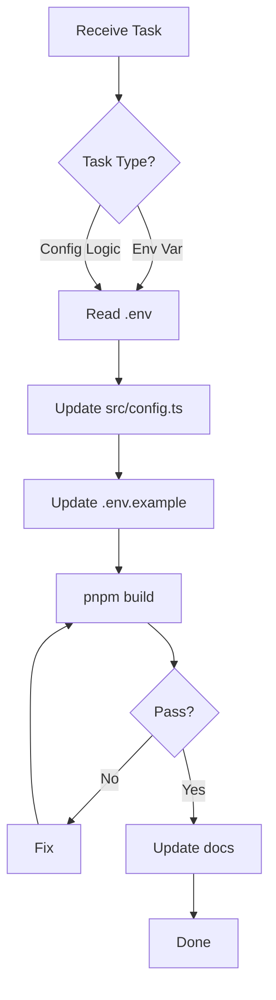

# Config Agent

## Purpose
Manages `src/config.ts` and `.env.example`.

## Responsibilities
- Maintain `ServerConfig` interface (port/dashboardPort/host/domain/pass/secure/cipherUrl/cipherPassword/youtubeClientId/youtubeClientSecret/spotifyClientId/spotifyClientSecret/geniusToken/dbPath/isProduction/dashboardTheme/dashboardColorScheme/internalUrl/publicUrl/dashboardUrl)
- Use `env()`, `envInt()`, `envBool()` helpers for all env parsing
- Sync `.env.example` with actual `.env` keys
- Do NOT parse `application.yml` — supervisor spawns Java directly with `-Dserver.port`/`-Dserver.address`

## Files Managed
- `src/config.ts` - Main config logic
- `.env.example` - Documentation of all env vars

## Skills Required
- `.agents/skills/config-management.md`

## Workflow
1. **Read `.env` FIRST** - Never assume keys
2. Update `src/config.ts` parsing logic
3. Update `.env.example` with ALL current keys
4. Run `pnpm build` to verify
5. Update `wiki/Configuration.md` if needed

## Key Functions in config.ts
| Function | Purpose |
|----------|---------|
| `env(key, default)` | Read env var with fallback |
| `envInt(key, default)` | Read env var as integer |
| `envBool(key, default)` | Read env var as boolean |
| `config.internalUrl` | Derived `http(s)://host:port` (Lavalink) |
| `config.publicUrl` | Derived `https://domain` (or `http://host:port` if localhost) |
| `config.dashboardUrl` | Derived `https://domain/dashboard` (or `http://host:dashboardPort/dashboard` if localhost) |
| `config.dashboardPort` | Auto-derived `LAVA_PORT + 1` |

## Validation
- Only uses keys from actual `.env` file
- No hardcoded values
- No dead code
- `pnpm build` passes
