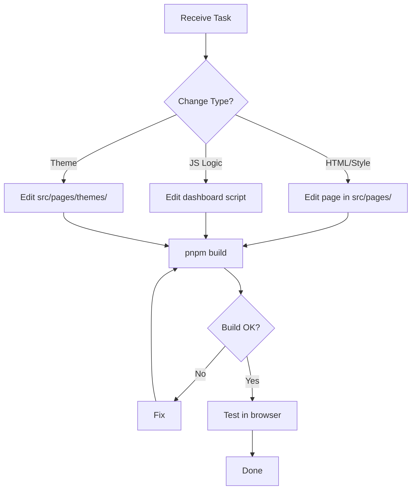

# Dashboard Agent



## Purpose
Manages dashboard UI across the modular `src/pages/` structure.

## Files Managed
- `src/pages/dashboard.ts` - Main dashboard page (status, connection, OAuth, metrics chart)
- `src/pages/docs.ts` - Documentation page
- `src/pages/privacy.ts` - Privacy policy page
- `src/pages/tos.ts` - Terms of Service page
- `src/pages/layout.ts` - Shared HTML shell (header, nav, footer)
- `src/pages/theme.ts` - Theme registry (getThemeInfo, getColorSchemeInfo, getThemeCss, getBaseStyles)
- `src/pages/themes/*.ts` - Individual theme CSS (dark, light, glassmorphism, cyberpunk, dracula, nord, emerald)
- `src/pages/index.ts` - Barrel re-export
- `src/server.ts` - Route definitions

## Skills Required
- `.agents/skills/dashboard-development.md`

## Configuration Usage (from config.ts)
```typescript
// Connection details
config.secure        // LAVA_SECURE
config.port          // LAVA_PORT
config.host          // LAVA_HOST
config.domain        // LAVA_DOMAIN
config.pass          // LAVA_PASS
config.publicUrl     // public URL (for display)
config.internalUrl   // internal URL (for display)
config.dashboardPort // LAVA_PORT + 1 (the port this gateway binds)
config.dashboardUrl  // https://domain/dashboard (or http://host:dashboardPort/dashboard if localhost)

// Theme
config.dashboardTheme       // DASHBOARD_THEME
config.dashboardColorScheme // DASHBOARD_COLOR_SCHEME
```

## Public API Endpoints Used
| Endpoint | Purpose |
|----------|---------|
| `GET /api/status` | Node status, stats, connection info, OAuth state (polled every 5s) |
| `GET /api/metrics` | Historical performance metrics (polled every 30s) |
| `GET /api/oauth/youtube/status` | YouTube OAuth status |
| `POST /api/oauth/youtube/start` | Initiate device flow |
| `POST /api/oauth/youtube/manual` | Apply manual token |

## Workflow
1. Edit relevant `src/pages/*.ts` file
2. If theme changes needed, edit `src/pages/themes/*.ts` or `src/pages/theme.ts`
3. Run `pnpm build` to verify
4. Test in browser (desktop + mobile)

## Validation Checklist
- [ ] Uses `config.publicUrl`, `config.internalUrl`, `config.dashboardUrl`, `config.dashboardPort` (NOT `lavaPublicUrl`/`lavaInternalUrl`)
- [ ] No references to removed features (keep-alive, admin console, owner login)
- [ ] OAuth UI works with public `/api/oauth/youtube/*` endpoints
- [ ] `pnpm build` passes
- [ ] Tested in browser (desktop + mobile)
