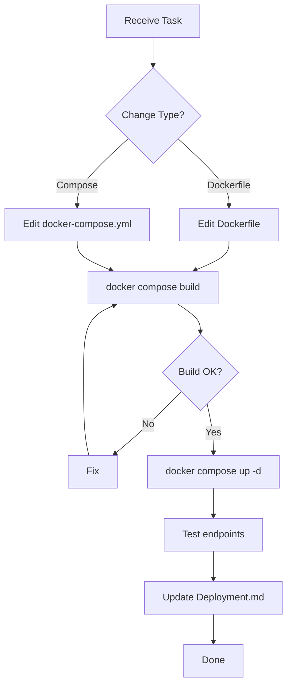

# Docker Agent



## Purpose
Manages Docker deployment: `Dockerfile`, `docker-compose.yml`

## Responsibilities
- Lavalink JAR download at build time (not in repo)
- Port exposure (2333 Lavalink + 2334 dashboard = LAVA_PORT + 1)
- Environment variable mapping in compose
- Volume for SQLite persistence

## Files Managed
- `Dockerfile` - Build with eclipse-temurin:21-jre-alpine
- `docker-compose.yml` - Service definition

## Skills Required
- `.agents/skills/docker-deployment.md`

## Current Dockerfile
```dockerfile
FROM eclipse-temurin:21-jre-alpine
RUN apk add --no-cache nodejs npm curl
WORKDIR /opt/Lavalink
ARG LAVALINK_VERSION=latest
RUN curl -L -o Lavalink.jar "https://github.com/lavalink-devs/Lavalink/releases/${LAVALINK_VERSION}/download/Lavalink.jar"
COPY package.json ./
RUN npm install
COPY tsconfig.json ./
COPY src/ ./src/
RUN npm run build && npm prune --production
COPY application.yml ./application.yml
EXPOSE 2333 2334
CMD ["node", "dist/index.js"]
```

## Current docker-compose.yml
```yaml
services:
  lavalink:
    build: .
    restart: unless-stopped
    ports:
      - "${LAVA_PORT:-2333}:2333"
      - "2334:2334"  # Dashboard (LAVA_PORT + 1)
    environment:
      - LAVA_DOMAIN=${LAVA_DOMAIN:-}
      - LAVA_HOST=${LAVA_HOST:-127.0.0.1}
      - LAVA_PORT=${LAVA_PORT:-2333}
      - LAVA_PASS=${LAVA_PASS:-youshallnotpass}
      - LAVA_SECURE=${LAVA_SECURE:-false}
      - LAVA_CIPHER_URL=${LAVA_CIPHER_URL:-https://cipher.kikkia.dev/}
      - LAVA_CIPHER_PASSWORD=${LAVA_CIPHER_PASSWORD:-}
      - YOUTUBE_CLIENT_ID=${YOUTUBE_CLIENT_ID:-}
      - YOUTUBE_CLIENT_SECRET=${YOUTUBE_CLIENT_SECRET:-}
      - YOUTUBE_REFRESH_TOKEN=${YOUTUBE_REFRESH_TOKEN:-}
      - SPOTIFY_CLIENT_ID=${SPOTIFY_CLIENT_ID:-}
      - SPOTIFY_CLIENT_SECRET=${SPOTIFY_CLIENT_SECRET:-}
      - GENIUS_ACCESS_TOKEN=${GENIUS_ACCESS_TOKEN:-}
      - DB_PATH=${DB_PATH:-./database.db}
      - DB_URI=${DB_URI:-sqlite://./database.db}
      - DASHBOARD_THEME=${DASHBOARD_THEME:-dark}
      - DASHBOARD_COLOR_SCHEME=${DASHBOARD_COLOR_SCHEME:-default}
      - DASHBOARD_PUBLIC_URL=${DASHBOARD_PUBLIC_URL:-}
      - DASHBOARD_INTERNAL_URL=${DASHBOARD_INTERNAL_URL:-}
      - NODE_ENV=${NODE_ENV:-production}
    volumes:
      - ./data:/opt/Lavalink/data
```

## Validation Checklist
- [ ] Lavalink JAR downloads from official releases
- [ ] Only ports 2333 + 2334 exposed
- [ ] All valid `.env` keys in compose environment
- [ ] Volume for SQLite persistence
- [ ] `docker compose build && docker compose up -d` works
- [ ] Deployment.md updated
