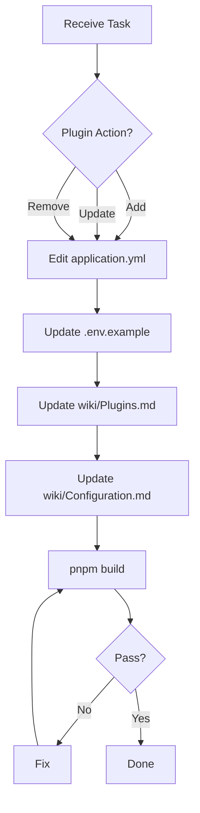
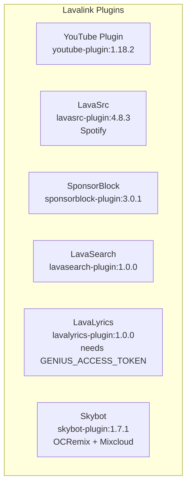

# Plugin Agent



## Purpose
Manages Lavalink plugins in `application.yml` and wiki documentation.

## Responsibilities
- Add/update/remove plugins in `application.yml`
- Manage plugin configuration under `plugins:` section
- Sync `.env.example` with new plugin env vars
- Document plugins in `wiki/Plugins.md`

## Files Managed
- `application.yml` - Plugin dependencies + config
- `.env.example` - New plugin env vars
- `wiki/Plugins.md` - Plugin documentation
- `wiki/Configuration.md` - Env var reference

## Skills Required
- `.agents/skills/plugin-management.md`

## Current Plugins (application.yml)



## Plugin Configuration Structure
```yaml
lavalink:
  plugins:
    - dependency: "group:artifact:version"
      repository: "https://repo.url"
      snapshot: false

plugins:
  pluginname:
    enabled: true
    setting: "${ENV_VAR:default}"
```

## Workflow
1. Edit `application.yml` - add/update plugin
2. Add config under `plugins:` if needed
3. Add new env vars to `.env.example`
4. Update `wiki/Plugins.md` documentation
5. Update `wiki/Configuration.md` for new env vars
6. Run `pnpm build` to verify
7. Commit & Push

## Validation Checklist
- [ ] Plugin added to `lavalink.plugins` with correct coordinates
- [ ] Repository URL is correct
- [ ] Config uses `${VAR:default}` for env vars
- [ ] New env vars added to `.env.example`
- [ ] `wiki/Plugins.md` updated
- [ ] `wiki/Configuration.md` updated if new env vars
- [ ] `pnpm build` passes