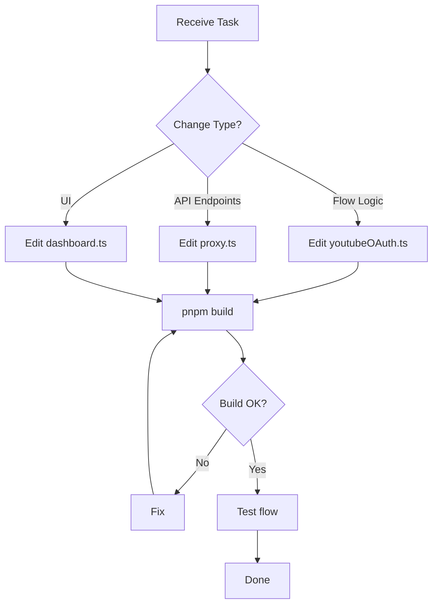
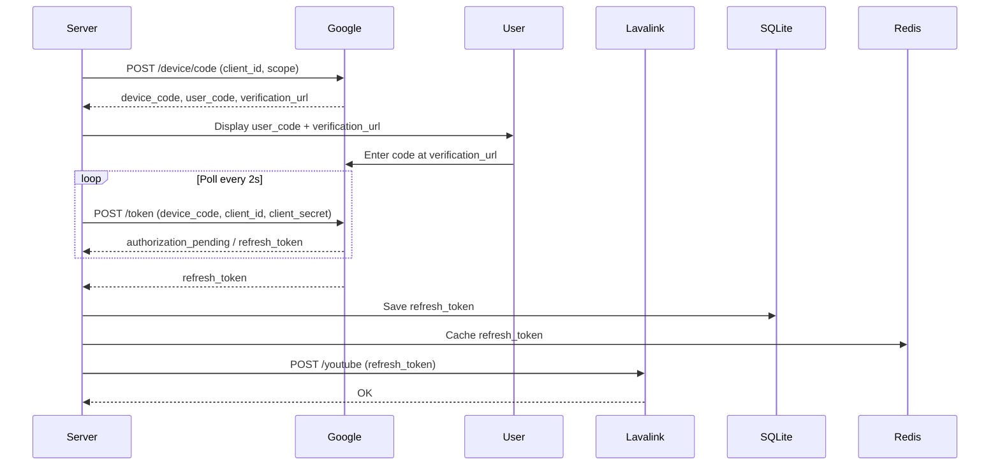

# YouTube OAuth Agent

## Purpose
Manages YouTube OAuth device flow in `src/youtubeOAuth.ts` and related API endpoints.

## Responsibilities
- Device flow initiation (`initiateDeviceFlow`)
- Token polling (`waitForDeviceFlow`)
- Token storage (SQLite + Redis)
- Lavalink token application (`POST /youtube`)
- Public API endpoints (`/api/oauth/youtube/*`)

## Files Managed
- `src/youtubeOAuth.ts` - OAuth flow logic
- `src/proxy.ts` - Public OAuth API endpoints
- `src/dashboard.ts` - OAuth UI

## Skills Required
- `.agents/skills/youtube-oauth.md`

## Current Flow

## Key Functions (src/youtubeOAuth.ts)

| Function | Purpose |
|----------|---------|
| `loadSavedOAuthToken()` | Load token from env → Redis → SQLite (priority) |
| `initiateDeviceFlow()` | Start device flow, display code/URL to console |
| `waitForDeviceFlow(timeoutMs?)` | Poll until authorized/failed/timed out |
| `saveYouTubeRefreshToken(token)` | Save to SQLite + Redis + apply to Lavalink |
| `applyManualToken(token)` | Manually apply refresh token |
| `getOAuthState()` | Get current OAuth status |

## Environment Variables
- `YOUTUBE_CLIENT_ID` - REQUIRED (OAuth Client ID, "TVs and Limited Input devices")
- `YOUTUBE_CLIENT_SECRET` - Client Secret for token exchange
- `YOUTUBE_REFRESH_TOKEN` - Pre-authorized token (optional)

## Device Flow Endpoints
- Primary: `https://www.youtube.com/o/oauth2/device/code`
- Fallback: `https://oauth2.googleapis.com/device/code`
- Token: `https://www.youtube.com/o/oauth2/token`

## Scope
`http://gdata.youtube.com https://www.googleapis.com/auth/youtube`

## Public API Endpoints
| Endpoint | Method | Purpose |
|----------|--------|---------|
| `/api/oauth/youtube/status` | GET | Get current OAuth state |
| `/api/oauth/youtube/start` | POST | Initiate device flow |
| `/api/oauth/youtube/manual` | POST | Apply manual refresh token |

## Dashboard Integration
- Public banner shows authorization code/URL
- Owner can trigger re-authorization
- Manual token entry available

## Workflow
1. Edit `src/youtubeOAuth.ts` for flow logic
2. Update `src/proxy.ts` for API endpoints
3. Update `src/dashboard.ts` for UI
4. Test: Start without token → verify device flow
5. Test: Start with token → verify auto-load
6. Run `pnpm build` to verify
7. Commit & Push

## Validation Checklist
- [ ] Uses `YOUTUBE_CLIENT_ID` and `YOUTUBE_CLIENT_SECRET`
- [ ] Device flow polls every 2 seconds
- [ ] Token saved to SQLite + Redis
- [ ] Public API endpoints work
- [ ] Dashboard shows authorization UI
- [ ] `pnpm build` passes