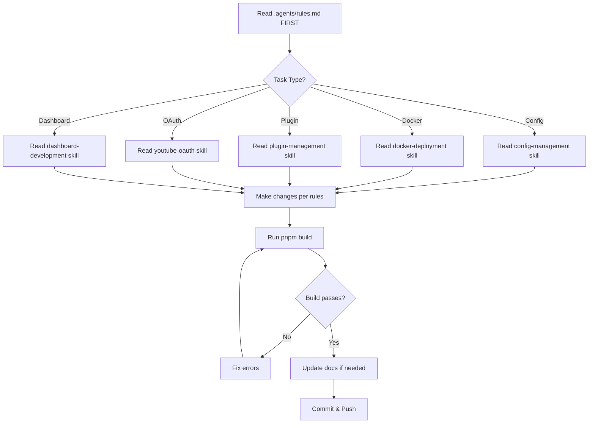
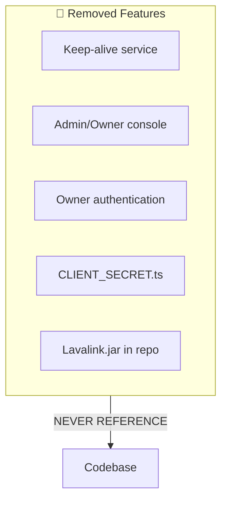
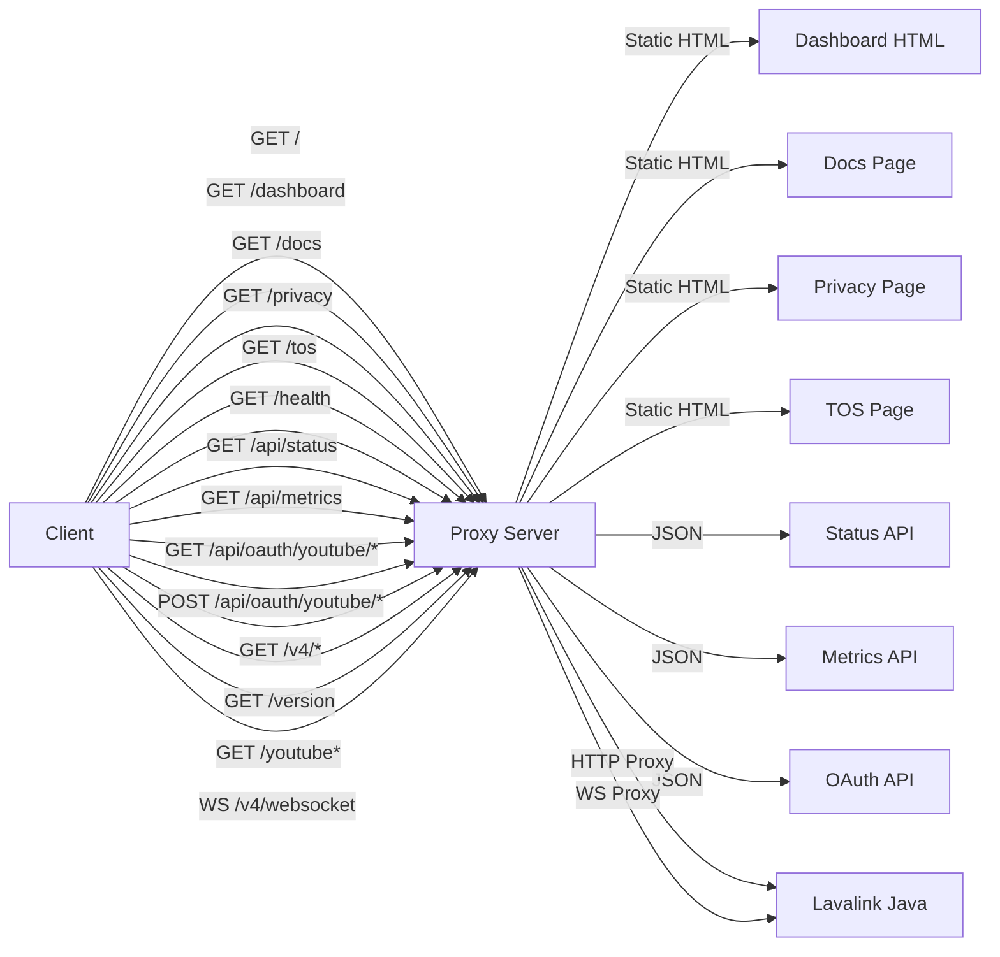
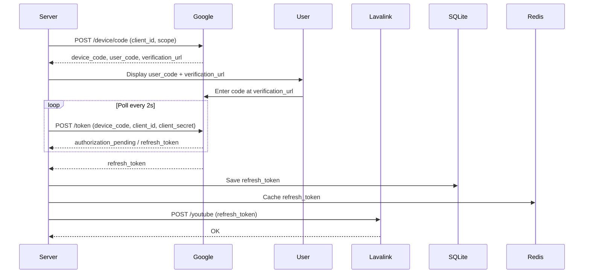
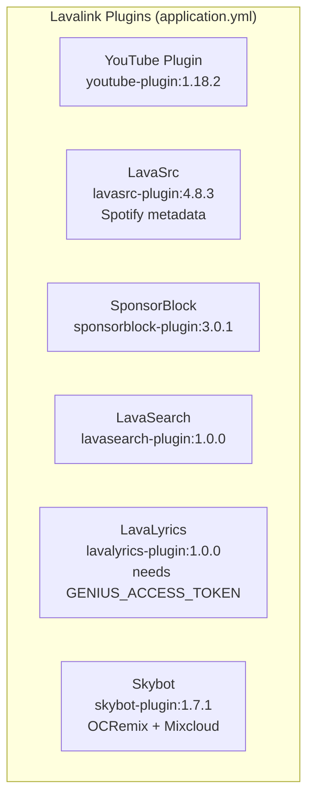

# Lavalink-Server Agent Rules



## CRITICAL RULES - NEVER VIOLATE

### 1. Environment Variables - ONLY USE WHAT'S IN .env

```mermaid
graph LR
    subgraph Valid["✅ Current Valid .env Keys"]
        A1[LAVA_DOMAIN]
        A2[LAVA_HOST]
        A3[LAVA_PORT]
        A4[LAVA_PASS]
        A4[LAVA_SECURE]
        A5[LAVA_CIPHER_URL]
        A6[LAVA_CIPHER_PASSWORD]
        A7[YOUTUBE_CLIENT_ID]
        A8[YOUTUBE_CLIENT_SECRET]
        A8[YOUTUBE_REFRESH_TOKEN]
        A9[SPOTIFY_CLIENT_ID]
        A9[SPOTIFY_CLIENT_SECRET]
        A9[GENIUS_ACCESS_TOKEN]
        A10[NODE_ENV]
        A11[DB_URI]
        A11[DB_PATH]
        A12[DASHBOARD_THEME]
        A12[DASHBOARD_COLOR_SCHEME]
    end

    subgraph Removed["❌ REMOVED - NEVER USE"]
        R1[PUBLIC_URL]
        R2[DASHBOARD_PORT]
        R3[DASHBOARD_PUBLIC_URL]
        R4[DASHBOARD_INTERNAL_URL]
        R5[INTERNAL_URL]
        R6[LAVA_INTERNAL_URL]
        R6[LAVA_PUBLIC_URL]
        R7[ADMIN_KEY]
        R8[ADMIN_PASSWORD]
        R9[KEEP_ALIVE_ENABLED]
        R9[KEEP_ALIVE_INTERVAL_MS]
        R10[YOUTUBE_API_KEY]
        R10[YOUTUBE_API_SECRET]
        R11[YOUTUBE_SKIP_INIT]
        R11[YOUTUBE_CIPHER_URL]
        R12[YOUTUBE_CIPHER_PASSWORD]
        R12[DOMAIN]
        R13[HOST]
        R13[PORT]
        R13[SERVER_PORT]
    end

    Valid -.->|USE ONLY| Removed
```



**Current valid .env keys:**
- `LAVA_DOMAIN` - Public domain/host (e.g., `https://lavalink.helix-origin.club`)
- `LAVA_HOST` - Lavalink bind address (e.g., `127.0.0.1`)
- `LAVA_PORT` - Lavalink port (e.g., `2333`)
- `LAVA_PASS` - Lavalink authentication password
- `LAVA_SECURE` - Use HTTPS for Lavalink (true/false)
- `LAVA_CIPHER_URL` - Remote cipher endpoint
- `LAVA_CIPHER_PASSWORD` - Optional password for self-hosted cipher
- `YOUTUBE_CLIENT_ID` - REQUIRED - YouTube OAuth Client ID
- `YOUTUBE_CLIENT_SECRET` - YouTube OAuth Client Secret
- `YOUTUBE_REFRESH_TOKEN` - Pre-authorized refresh token
- `SPOTIFY_CLIENT_ID` - Spotify Developer App Client ID
- `SPOTIFY_CLIENT_SECRET` - Spotify Developer App Client Secret
- `GENIUS_ACCESS_TOKEN` - Genius API Access Token for lyrics
- `NODE_ENV` - Set to "production" for production mode
- `DB_URI` - SQLite database URI
- `DB_PATH` - SQLite database file path
- `DASHBOARD_THEME` - Dashboard theme: glassmorphism | dark | light | cyberpunk | dracula | nord | emerald (default: dark)
- `DASHBOARD_COLOR_SCHEME` - Accent color: default | cyan | purple | blue | emerald | rose | amber | indigo | crimson | teal | sunset

**NEVER USE THESE REMOVED KEYS:**
- ❌ `PUBLIC_URL`
- ❌ `DASHBOARD_PORT`
- ❌ `DASHBOARD_PUBLIC_URL` / `DASHBOARD_INTERNAL_URL`
- ❌ `INTERNAL_URL` / `LAVA_INTERNAL_URL` / `LAVA_PUBLIC_URL`
- ❌ `ADMIN_KEY` / `ADMIN_PASSWORD`
- ❌ `KEEP_ALIVE_ENABLED` / `KEEP_ALIVE_INTERVAL_MS`
- ❌ `YOUTUBE_API_KEY` / `YOUTUBE_API_SECRET` — **NEVER USE.** These are YouTube's *API key / API secret* (a separate credential mechanism). This server uses **OAuth** credentials, so the correct keys are `YOUTUBE_CLIENT_ID` / `YOUTUBE_CLIENT_SECRET`. Reintroducing the old names creates confusion with YouTube's unrelated API credentials.
- ❌ `YOUTUBE_SKIP_INIT` / `YOUTUBE_CIPHER_URL` / `YOUTUBE_CIPHER_PASSWORD`
- ❌ `DOMAIN` / `HOST` / `PORT` / `SERVER_PORT`

### 2. REMOVED FEATURES - NEVER REFERENCE THESE



- ❌ **Keep-alive service** - Completely removed, not needed on VPS
- ❌ **Admin/Owner console** - Removed, security risk
- ❌ **Owner authentication** - No `isOwnerAuthenticated`, no admin tokens
- ❌ **CLIENT_SECRET.ts** - Removed, redundant
- ❌ **Lavalink.jar in repo** - Download at build time from official releases

**Note:** `scripts/install-service.sh` EXISTS and is the supported way to create the systemd service (see `../../wiki/Deployment`).

### 3. CONFIG ARCHITECTURE

```mermaid
flowchart LR
    subgraph Env[".env File"]
        ENV1[LAVA_DOMAIN]
        ENV2[LAVA_HOST]
        ENV3[LAVA_PORT]
        ENV4[LAVA_PASS]
        ENV4[LAVA_SECURE]
        ENV5[LAVA_CIPHER_URL]
        ENV6[LAVA_CIPHER_PASSWORD]
        ENV7[YOUTUBE_CLIENT_ID]
        ENV8[YOUTUBE_CLIENT_SECRET]
        ENV8[YOUTUBE_REFRESH_TOKEN]
        ENV9[SPOTIFY_CLIENT_ID]
        ENV9[SPOTIFY_CLIENT_SECRET]
        ENV9[GENIUS_ACCESS_TOKEN]
        ENV10[NODE_ENV]
        ENV10[DB_URI]
        ENV10[DB_PATH]
        ENV11[DASHBOARD_THEME]
        ENV11[DASHBOARD_COLOR_SCHEME]
    end

    subgraph Config["src/config.ts"]
        C1[LAVA_HOST / LAVA_PORT]
        C2[DASHBOARD_THEME / DASHBOARD_COLOR_SCHEME]
        C3[Derived URL builders]
    end

    subgraph ServerConfig["ServerConfig Interface"]
        SC1[port: number]
        SC2[host: string]
        SC3[domain: string]
        SC4[pass: string]
        SC5[secure: boolean]
        SC6[youtubeClientId: string]
        SC7[youtubeClientSecret: string]
        SC8[dbPath: string]
        SC9[isProduction: boolean]
        SC10[dashboardTheme: string]
        SC11[dashboardColorScheme: string]
        SC12[internalUrl: string]
        SC13[publicUrl: string]
    end

    Env --> Config
    Config --> ServerConfig
```



**Simplified ServerConfig interface:**
```typescript
interface ServerConfig {
  port: number;              // LAVA_PORT (dashboard on /dashboard)
  host: string;              // LAVA_HOST (bind address)
  domain: string;            // LAVA_DOMAIN (public domain)
  pass: string;              // LAVA_PASS
  secure: boolean;           // LAVA_SECURE (true/false)
  cipherUrl: string;         // LAVA_CIPHER_URL
  cipherPassword: string;    // LAVA_CIPHER_PASSWORD
  youtubeClientId: string;   // YOUTUBE_CLIENT_ID
  youtubeClientSecret: string; // YOUTUBE_CLIENT_SECRET
  spotifyClientId: string;   // SPOTIFY_CLIENT_ID
  spotifyClientSecret: string; // SPOTIFY_CLIENT_SECRET
  geniusToken: string;       // GENIUS_ACCESS_TOKEN
  dbPath: string;            // DB_PATH
  isProduction: boolean;     // NODE_ENV === 'production'
  dashboardTheme: string;    // DASHBOARD_THEME (default 'dark')
  dashboardColorScheme: string; // DASHBOARD_COLOR_SCHEME (default 'default')
  internalUrl: string;       // http(s)://host:port
  publicUrl: string;         // https://domain (or http(s)://host:port if localhost)
}
```

**URL Parsing:**
- `LAVA_PORT` → port (dashboard on /dashboard)
- `LAVA_HOST` → host (bind address)
- `LAVA_DOMAIN` → domain, publicUrl
- `LAVA_HOST` + `LAVA_PORT` + `LAVA_SECURE` → internalUrl

### 4. PROXY ENDPOINTS (Current)



```
GET  /                    → Dashboard (serves /dashboard)
GET  /dashboard           → Dashboard
GET  /dashboard/docs      → Documentation page
GET  /dashboard/privacy   → Privacy policy page
GET  /dashboard/tos       → Terms of Service page
GET  /health              → Health check
GET  /api/status          → Public connection details + YouTube OAuth status
GET  /api/metrics         → Performance metrics
GET  /api/oauth/youtube/status    → YouTube OAuth status
POST /api/oauth/youtube/start     → Start device flow
POST /api/oauth/youtube/manual    → Apply manual token
GET  /v4/*                → Proxy to Lavalink
GET  /version             → Proxy to Lavalink
GET  /youtube*            → Proxy to Lavalink
WS   /v4/websocket        → WebSocket proxy to Lavalink
```

### 5. DASHBOARD
- No owner console/lock banner
- No admin login modal
- No keep-alive widget
- No live log viewport
- No manual token modal (OAuth is public via /api/oauth/youtube)
- Public YouTube OAuth flow accessible to anyone
- Dashboard runs on same port as Lavalink via `/dashboard` endpoint
- Static pages: `/dashboard/docs`, `/dashboard/tos`, `/dashboard/privacy`
- Lavalink internal: port visible (e.g., `http://localhost:2333`)
- Lavalink public: port visible (e.g., `https://domain.com:2333`)
- Dashboard internal: port visible (e.g., `http://localhost:2333/dashboard`)
- Dashboard public: port masked (e.g., `https://domain.com/dashboard`)
- Uses `config.publicUrl` for Lavalink public, `config.internalUrl` for Lavalink internal
- Theme support: `DASHBOARD_THEME` (glassmorphism/dark/light/cyberpunk/dracula/nord/emerald) + `DASHBOARD_COLOR_SCHEME` (accent colors)
- Theme registry: `src/pages/theme.ts`, themes in `src/pages/themes/*.ts`, layout shell in `src/pages/layout.ts`

### 6. YOUTUBE OAUTH


- Uses `YOUTUBE_CLIENT_ID` and `YOUTUBE_CLIENT_SECRET`
- Device flow: `initiateDeviceFlow()` → `waitForDeviceFlow()` on startup if no token
- Public API: `/api/oauth/youtube/*` (no auth required)
- Token auto-saved to SQLite + Redis

### 7. PLUGINS (application.yml)


1. YouTube Plugin (`youtube-plugin:1.18.2`)
2. LavaSrc (`lavasrc-plugin:4.8.3`) - Spotify metadata
3. SponsorBlock (`sponsorblock-plugin:3.0.1`)
4. LavaSearch (`lavasearch-plugin:1.0.0`)
5. LavaLyrics (`lavalyrics-plugin:1.0.0`) - needs `GENIUS_ACCESS_TOKEN`
6. Skybot (`skybot-plugin:1.7.1`) - OCRemix + Mixcloud enabled

### 8. DEPLOYMENT
- **Docker**: Dockerfile downloads Lavalink JAR at build time
- **docker-compose.yml**: Uses LAVA_DOMAIN, LAVA_HOST, LAVA_PORT, LAVA_PASS, LAVA_SECURE, etc.
- **Systemd**: Install via `sudo ./scripts/install-service.sh` (creates hardened unit automatically)
- **No old install-service in scripts** - replaced by `scripts/install-service.sh`

### 9. CODE STYLE
- No dead code - if feature removed, remove ALL references
- No hardcoded values - everything from config/env
- No abandoned keys - if env var removed, remove from config.ts, .env.example, docs
- TypeScript strict mode
- ESM modules only

### 10. DOCUMENTATION
- Wiki links: `../../wiki/PageName` (NO `.md` extension)
- Keep README, Configuration.md, Deployment.md, Plugins.md, Client-Integration.md, Troubleshooting.md in sync
- Footer in wiki/_Footer.md

---

## ENFORCEMENT
Before ANY code change, verify:
1. ✅ Only uses current .env keys
2. ✅ No references to removed features
3. ✅ No hardcoded values
4. ✅ No dead code
5. ✅ Config matches current .env exactly

**IF IN DOUBT: READ THE USER'S ACTUAL .env FILE FIRST**