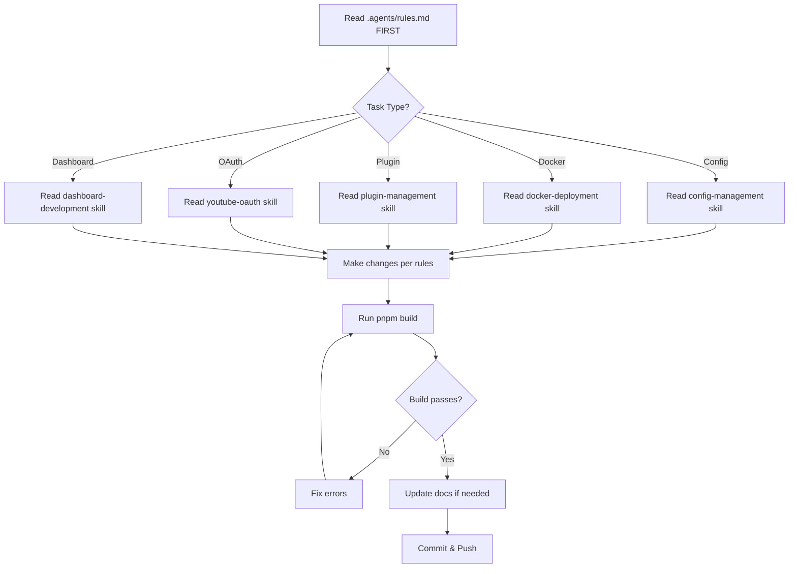
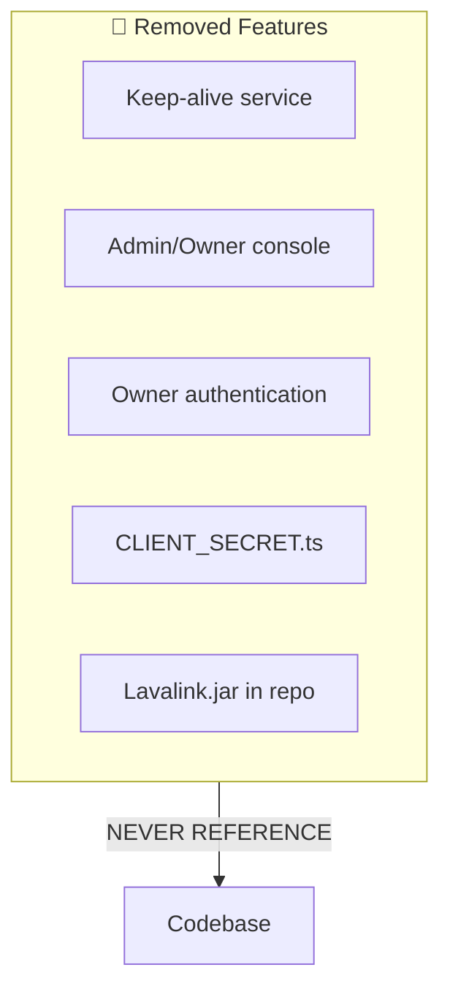
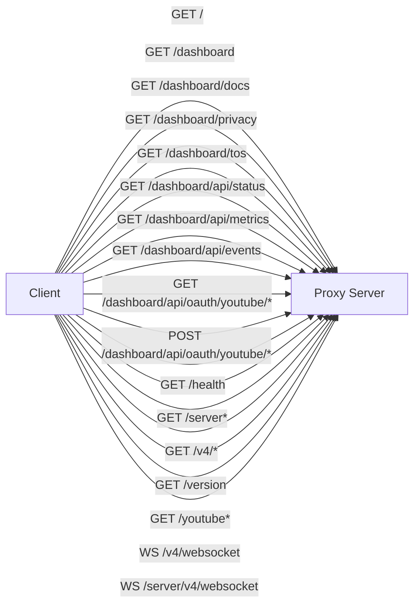
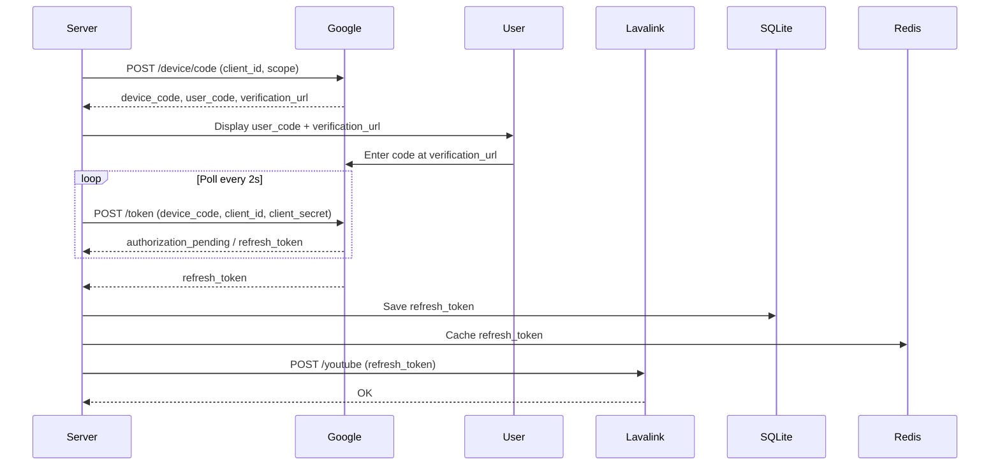
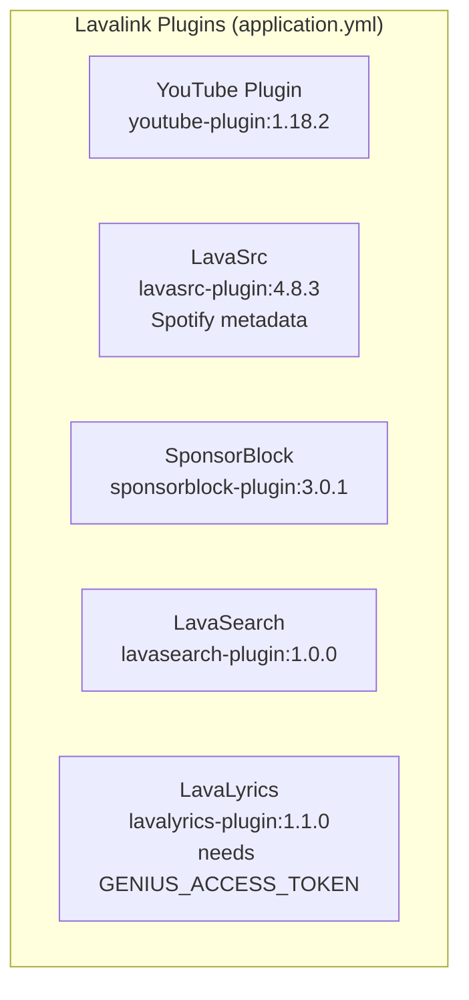

# Lavalink-Server Agent Rules



## CRITICAL RULES - NEVER VIOLATE

### 1. Environment Variables - ONLY USE WHAT'S IN .env

```mermaid
graph LR
    subgraph Valid["✅ Current Valid .env Keys"]
        A1[LAVA_INTERNAL_URL]
        A2[LAVA_PUBLIC_URL]
        A3[LAVA_INTERNAL_WS_URI]
        A4[LAVA_PUBLIC_WS_URI]
        A5[LAVA_PASS]
        A6[LAVA_CIPHER_URL]
        A7[LAVA_CIPHER_PASSWORD]
        A8[YOUTUBE_CLIENT_ID]
        A8[YOUTUBE_CLIENT_SECRET]
        A8[YOUTUBE_REFRESH_TOKEN]
        A9[SPOTIFY_CLIENT_ID]
        A9[SPOTIFY_CLIENT_SECRET]
        A9[GENIUS_ACCESS_TOKEN]
        A10[NODE_ENV]
        A11[DB_URI]
        A11[DB_PATH]
        A12[DASHBOARD_THEME]
        A12[DASHBOARD_COLOR_SCHEME]
        A13[REVERSE_PROXY_ENABLED]
        A13[REVERSE_PROXY_TYPE]
    end

    subgraph Removed["❌ REMOVED - NEVER USE"]
        R1[LAVA_DOMAIN]
        R2[LAVA_HOST]
        R3[LAVA_PORT]
        R4[LAVA_SECURE]
        R5[DASHBOARD_PUBLIC_URL]
        R6[DASHBOARD_INTERNAL_URL]
        R7[PUBLIC_URL]
        R8[DASHBOARD_PORT]
        R9[INTERNAL_URL]
        R10[ADMIN_KEY]
        R11[ADMIN_PASSWORD]
        R12[KEEP_ALIVE_ENABLED]
        R12[KEEP_ALIVE_INTERVAL_MS]
        R13[YOUTUBE_API_KEY]
        R13[YOUTUBE_API_SECRET]
        R14[YOUTUBE_SKIP_INIT]
        R14[YOUTUBE_CIPHER_URL]
        R15[YOUTUBE_CIPHER_PASSWORD]
        R16[DOMAIN]
        R17[HOST]
        R18[PORT]
        R18[SERVER_PORT]
    end

    Valid -.->|USE ONLY| Removed
```



**Current valid .env keys:**
- `LAVA_INTERNAL_URL` - Internal network bind URL (e.g., `0.0.0.0:2333`). Host + port the Lavalink Java node binds to.
- `LAVA_PUBLIC_URL` - Public network URL (e.g., `https://lavalink.helix-origin.club`). Port is masked (behind Cloudflare/tunnel). Bots append endpoints to this base URL.
- `LAVA_INTERNAL_WS_URI` - Internal WebSocket URI (e.g., `ws://0.0.0.0:2333/v4/websocket`). Upstream proxy target (host + port + path parsed from it).
- `LAVA_PUBLIC_WS_URI` - Public WebSocket URI (e.g., `ws://lavalink.helix-origin.club/v4/websocket`). Port masked in URL.
- `LAVA_PASS` - Lavalink authentication password
- `LAVA_CIPHER_URL` - Remote cipher endpoint
- `LAVA_CIPHER_PASSWORD` - Optional password for self-hosted cipher
- `YOUTUBE_CLIENT_ID` - REQUIRED - YouTube OAuth Client ID
- `YOUTUBE_CLIENT_SECRET` - YouTube OAuth Client Secret
- `YOUTUBE_REFRESH_TOKEN` - Pre-authorized refresh token
- `SPOTIFY_CLIENT_ID` - Spotify Developer App Client ID
- `SPOTIFY_CLIENT_SECRET` - Spotify Developer App Client Secret
- `GENIUS_ACCESS_TOKEN` - Genius API Access Token for lyrics
- `NODE_ENV` - Set to "production" for production mode
- `DB_URI` - SQLite database URI
- `DB_PATH` - SQLite database file path
- `DASHBOARD_THEME` - Dashboard theme: glassmorphism | dark | light | cyberpunk | dracula | nord | emerald (default: dark)
- `DASHBOARD_COLOR_SCHEME` - Accent color: default | cyan | purple | blue | emerald | rose | amber | indigo | crimson | teal | sunset
- `REVERSE_PROXY_ENABLED` - "true" when public URL is served via a Cloudflare tunnel / reverse proxy that masks the public port (drives the dashboard's `portMasked` flag)
- `REVERSE_PROXY_TYPE` - Masking indicator label: cloudflare | nginx | caddy | custom (only when REVERSE_PROXY_ENABLED=true)

**NEVER USE THESE REMOVED KEYS:**
- ❌ `LAVA_DOMAIN` / `LAVA_HOST` / `LAVA_PORT` / `LAVA_SECURE` — replaced by the combined URL fields
- ❌ `DASHBOARD_PUBLIC_URL` / `DASHBOARD_INTERNAL_URL`
- ❌ `PUBLIC_URL`
- ❌ `DASHBOARD_PORT`
- ❌ `INTERNAL_URL`
- ❌ `ADMIN_KEY` / `ADMIN_PASSWORD`
- ❌ `KEEP_ALIVE_ENABLED` / `KEEP_ALIVE_INTERVAL_MS`
- ❌ `YOUTUBE_API_KEY` / `YOUTUBE_API_SECRET` — **NEVER USE.** These are YouTube's *API key / API secret* (a separate credential mechanism). This server uses **OAuth** credentials, so the correct keys are `YOUTUBE_CLIENT_ID` / `YOUTUBE_CLIENT_SECRET`. Reintroducing the old names creates confusion with YouTube's unrelated API credentials.
- ❌ `YOUTUBE_SKIP_INIT` / `YOUTUBE_CIPHER_URL` / `YOUTUBE_CIPHER_PASSWORD`
- ❌ `DOMAIN` / `HOST` / `PORT` / `SERVER_PORT`

### 2. REMOVED FEATURES - NEVER REFERENCE THESE



- ❌ **Keep-alive service** - Completely removed, not needed on VPS
- ❌ **Admin/Owner console** - Removed, security risk
- ❌ **Owner authentication** - No `isOwnerAuthenticated`, no admin tokens
- ❌ **CLIENT_SECRET.ts** - Removed, redundant
- ❌ **Lavalink.jar in repo** - Download at build time from official releases

**Note:** `scripts/install-service.sh` EXISTS and is the supported way to create the systemd service (see `../../wiki/Deployment`).

### 3. CONFIG ARCHITECTURE

```mermaid
flowchart LR
    subgraph Env[".env File"]
        ENV1[LAVA_INTERNAL_URL]
        ENV2[LAVA_PUBLIC_URL]
        ENV3[LAVA_INTERNAL_WS_URI]
        ENV4[LAVA_PUBLIC_WS_URI]
        ENV5[LAVA_PASS]
        ENV6[LAVA_CIPHER_URL]
        ENV7[LAVA_CIPHER_PASSWORD]
        ENV8[YOUTUBE_CLIENT_ID]
        ENV9[YOUTUBE_CLIENT_SECRET]
        ENV10[YOUTUBE_REFRESH_TOKEN]
        ENV11[SPOTIFY_CLIENT_ID]
        ENV12[SPOTIFY_CLIENT_SECRET]
        ENV13[GENIUS_ACCESS_TOKEN]
        ENV14[NODE_ENV]
        ENV15[DB_URI]
        ENV16[DB_PATH]
        ENV17[DASHBOARD_THEME]
        ENV18[DASHBOARD_COLOR_SCHEME]
        ENV19[REVERSE_PROXY_ENABLED]
        ENV20[REVERSE_PROXY_TYPE]
    end

    subgraph Config["src/config.ts"]
        C1[LAVA_INTERNAL_URL → internalHost + internalPort]
        C2[LAVA_PUBLIC_URL → publicHost + publicUrl + secure]
        C3[LAVA_INTERNAL_WS_URI → internalWsUri + internalWsProtocol/Host/Port/Path]
        C4[LAVA_PUBLIC_WS_URI → publicWsUri]
        C5[gateway = internalPort + 1]
        C6[REVERSE_PROXY_ENABLED / REVERSE_PROXY_TYPE → portMasked + proxyType]
        C7[DASHBOARD_THEME / DASHBOARD_COLOR_SCHEME]
    end

    subgraph ServerConfig["ServerConfig Interface"]
        SC1[internalHost: string]
        SC2[internalPort: number]
        SC3[internalUrl: string]
        SC4[internalWsUri: string]
        SC5[internalWsProtocol: 'ws' | 'wss']
        SC6[internalWsHost: string]
        SC7[internalWsPort: number]
        SC8[internalWsPath: string]
        SC9[publicHost: string]
        SC9[publicPort: number]
        SC10[publicUrl: string]
        SC11[publicWsUri: string]
        SC12[secure: boolean]
        SC13[reverseProxyEnabled: boolean]
        SC13[reverseProxyType: string]
        SC14[gatewayHost: string]
        SC15[gatewayPort: number]
        SC16[pass: string]
        SC17[youtubeClientId: string]
        SC18[youtubeClientSecret: string]
        SC19[dbPath: string]
        SC20[isProduction: boolean]
        SC21[dashboardTheme: string]
        SC22[dashboardColorScheme: string]
        SC23[dashboardEnabled: boolean]
        SC24[supervisorEnabled: boolean]
        SC25[youtubeOAuthEnabled: boolean]
    end

    Env --> Config
    Config --> ServerConfig
```

**Simplified ServerConfig interface:**
```typescript
interface ServerConfig {
  internalHost: string;      // parsed from LAVA_INTERNAL_URL (Lavalink node bind)
  internalPort: number;      // parsed from LAVA_INTERNAL_URL (Lavalink node port)
  internalUrl: string;       // internalHost:internalPort (verbatim)
  internalWsUri: string;     // LAVA_INTERNAL_WS_URI (verbatim, trailing / stripped)
  internalWsProtocol: 'ws' | 'wss'; // parsed from internal WS URI
  internalWsHost: string;    // parsed from internal WS URI
  internalWsPort: number;    // parsed from internal WS URI
  internalWsPath: string;    // parsed from internal WS URI (default /v4/websocket)
  publicHost: string;        // parsed from LAVA_PUBLIC_URL (scheme stripped)
  publicPort: number;        // explicit port from LAVA_PUBLIC_URL, else 443 (https) / 80 (http)
  publicUrl: string;         // LAVA_PUBLIC_URL (verbatim, trailing / stripped)
  publicWsUri: string;       // LAVA_PUBLIC_WS_URI or derived (secure?'wss':'ws')://publicHost/v4/websocket
  secure: boolean;           // true when LAVA_PUBLIC_URL uses https/wss
  reverseProxyEnabled: boolean; // REVERSE_PROXY_ENABLED — sets the dashboard's public portMasked flag
  reverseProxyType: string;  // REVERSE_PROXY_TYPE (cloudflare | nginx | caddy | custom)
  gatewayHost: string;       // internalHost (0.0.0.0 when internalHost is wildcard)
  gatewayPort: number;       // internalPort + 1 (dashboard / gateway bind)
  pass: string;              // LAVA_PASS
  cipherUrl: string;         // LAVA_CIPHER_URL
  cipherPassword: string;    // LAVA_CIPHER_PASSWORD
  youtubeClientId: string;   // YOUTUBE_CLIENT_ID
  youtubeClientSecret: string; // YOUTUBE_CLIENT_SECRET
  spotifyClientId: string;   // SPOTIFY_CLIENT_ID
  spotifyClientSecret: string; // SPOTIFY_CLIENT_SECRET
  geniusToken: string;       // GENIUS_ACCESS_TOKEN
  dbPath: string;            // DB_PATH
  isProduction: boolean;     // NODE_ENV === 'production'
  dashboardTheme: string;    // DASHBOARD_THEME (default 'dark')
  dashboardColorScheme: string; // DASHBOARD_COLOR_SCHEME (default 'default')
  dashboardEnabled: boolean; // false when imported as a library
  supervisorEnabled: boolean; // false to disable Lavalink process supervision
  youtubeOAuthEnabled: boolean; // false to disable the OAuth flow
}
```

**URL Parsing:**
- `LAVA_INTERNAL_URL` → internalHost + internalPort (node bind host:port)
- `LAVA_PUBLIC_URL` → publicHost (scheme stripped), publicUrl, secure (`https`), gateway behind tunnel → **public port masked**
- `LAVA_INTERNAL_WS_URI` → internalWsUri, internalWsProtocol/host/port/path (upstream proxy target)
- `LAVA_PUBLIC_WS_URI` → publicWsUri
- Gateway/dashboard port = `internalPort + 1` (auto-derived, no separate env var)
- Gateway host = `internalHost` (or `0.0.0.0` when internalHost is a wildcard)

### 4. PROXY ENDPOINTS (Current)



```
GET  /                            → 302 → /dashboard (404 JSON when dashboard disabled)
GET  /dashboard                   → Dashboard HTML
GET  /dashboard/docs              → Documentation page
GET  /dashboard/privacy           → Privacy policy page
GET  /dashboard/tos               → Terms of Service page
GET  /dashboard/api/status        → Separated internal/public connection details + YouTube OAuth status
GET  /dashboard/api/metrics       → Performance metrics
GET  /dashboard/api/events        → SSE stream (event: connection, every 5s) for real-time updates
GET  /dashboard/api/oauth/youtube/status    → YouTube OAuth status
POST /dashboard/api/oauth/youtube/start     → Start device flow
POST /dashboard/api/oauth/youtube/manual    → Apply manual token
GET  /health                      → Health check (internal/public connection, 200 online|starting else 503)
GET  /server, /server/*           → Proxy to Lavalink (path after /server passed through, default /v4/info)
GET  /v4/*                        → Proxy to Lavalink
GET  /version                     → Proxy to Lavalink
GET  /youtube*                    → Proxy to Lavalink
WS   /v4/websocket                → WebSocket proxy to Lavalink
WS   /server/v4/websocket         → WebSocket proxy to Lavalink
```

- All `/dashboard/*` routes are gated by `config.dashboardEnabled`; OAuth routes additionally by `config.youtubeOAuthEnabled`.

### 5. DASHBOARD
- No owner console/lock banner
- No admin login modal
- No keep-alive widget
- No live log viewport
- No manual token modal (OAuth is public via /dashboard/api/oauth/youtube)
- Public YouTube OAuth flow accessible to anyone
- Dashboard served at `/dashboard` on the gateway port (`internalPort + 1`)
- Gateway port is auto-derived from `LAVA_INTERNAL_URL`; there is no separate config
- Connection info displayed in two clearly labeled cards: **INTERNAL** and **PUBLIC**
  - Internal card: host, port, url, websocket uri (bind-level details)
  - Public card: host, url, websocket uri, secure flag, masked port hint, (masked) password with Show/Hide toggle
- Real-time updates via `/dashboard/api/events` SSE + 5s polling fallback
- Static pages: `/dashboard/docs`, `/dashboard/tos`, `/dashboard/privacy`
- Lavalink internal port is visible only in the internal card (e.g., `127.0.0.1:2333`)
- Lavalink public port is **masked** (behind Cloudflare/tunnel) and indicated in the UI
- Theme support: `DASHBOARD_THEME` (glassmorphism/dark/light/cyberpunk/dracula/nord/emerald) + `DASHBOARD_COLOR_SCHEME` (accent colors)
- Theme registry: `src/pages/theme.ts`, themes in `src/pages/themes/*.ts`, layout shell in `src/pages/layout.ts`

### 6. YOUTUBE OAUTH


- Uses `YOUTUBE_CLIENT_ID` and `YOUTUBE_CLIENT_SECRET`
- Device flow: `initiateDeviceFlow()` → `waitForDeviceFlow()` on startup if no token
- Public API: `/dashboard/api/oauth/youtube/*` (no auth required)
- Token auto-saved to SQLite + Redis
- OAuth routes + flow are disabled when `youtubeOAuthEnabled` is false (library import)

### 7. PLUGINS (application.yml)


1. YouTube Plugin (`youtube-plugin:1.18.2`)
2. LavaSrc (`lavasrc-plugin:4.8.3`) - Spotify metadata
3. SponsorBlock (`sponsorblock-plugin:3.0.1`)
4. LavaSearch (`lavasearch-plugin:1.0.0`)
5. LavaLyrics (`lavalyrics-plugin:1.1.0`) - needs `GENIUS_ACCESS_TOKEN`

### 8. DEPLOYMENT
- **Docker**: Dockerfile downloads Lavalink JAR at build time
- **docker-compose.yml**: Uses LAVA_INTERNAL_URL, LAVA_PUBLIC_URL, LAVA_INTERNAL_WS_URI, LAVA_PUBLIC_WS_URI, LAVA_PASS, LAVA_CIPHER_URL, LAVA_CIPHER_PASSWORD, etc. Exposes `${LAVA_INTERNAL_PORT:-2333}:2333` and `${LAVA_GATEWAY_PORT:-2334}:2334`
- **Systemd**: Install via `sudo ./scripts/install-service.sh` (creates hardened unit automatically)
- **No old install-service in scripts** - replaced by `scripts/install-service.sh`

### 9. LIBRARY / SUBMODULE IMPORT
- Entry point: `src/app.ts` (exports `config`, `configure`, `buildConfig`, `LavalinkSupervisor`, `createProxyServer`, `startServer`, `LavalinkConfigError`, types)
- `startServer(options)` throws `LavalinkConfigError` instead of `process.exit` when imported
- When imported as a submodule/library, the dashboard is **disabled by default** (`features.dashboard ?? false`)
- Host project can override config via `configure(overrides)` or `startServer({ overrides, features })`
- Feature toggles: `dashboard`, `supervisor`, `youtubeOAuth`

### 10. CODE STYLE
- No dead code - if feature removed, remove ALL references
- No hardcoded values - everything from config/env
- No abandoned keys - if env var removed, remove from config.ts, .env.example, docs
- TypeScript strict mode
- ESM modules only

### 11. DOCUMENTATION
- Wiki links: `../../wiki/PageName` (NO `.md` extension)
- Keep README, Configuration.md, Deployment.md, Plugins.md, Client-Integration.md, Troubleshooting.md in sync
- Footer in wiki/_Footer.md

### 12. COMMIT STANDARDS
Commit messages must be **detailed and human-readable**, using an **emoji** at the start for improved readability.

Format:
```
<emoji> <Short summary>
```

Guidelines:
- Start with a relevant emoji (e.g., 🔧 refactor/config, ✨ feature, 🐛 fix, 📝 docs, 🎨 style/theme, 📦 dependencies/deployment, 🚀 performance)
- Write a short, descriptive summary (imperative mood, ≤ ~70 chars)
- Keep the summary human-readable — no raw hashes, no "fix stuff" vagueness
- Optionally add a body with context/changed files when the change is non-obvious

Examples:
- `🔧 Modular restructure: pages, themes, config cleanup, systemd installer`
- `📝 Clarify YouTube env key naming rationale`
- `🐛 Fix SponsorBlock plugin version to 3.0.1`
- `✨ Add theme support to dashboard (DASHBOARD_THEME / DASHBOARD_COLOR_SCHEME)`

---

## ENFORCEMENT
Before ANY code change, verify:
1. ✅ Only uses current .env keys
2. ✅ No references to removed features
3. ✅ No hardcoded values
4. ✅ No dead code
5. ✅ Config matches current .env exactly

**IF IN DOUBT: READ THE USER'S ACTUAL .env FILE FIRST**