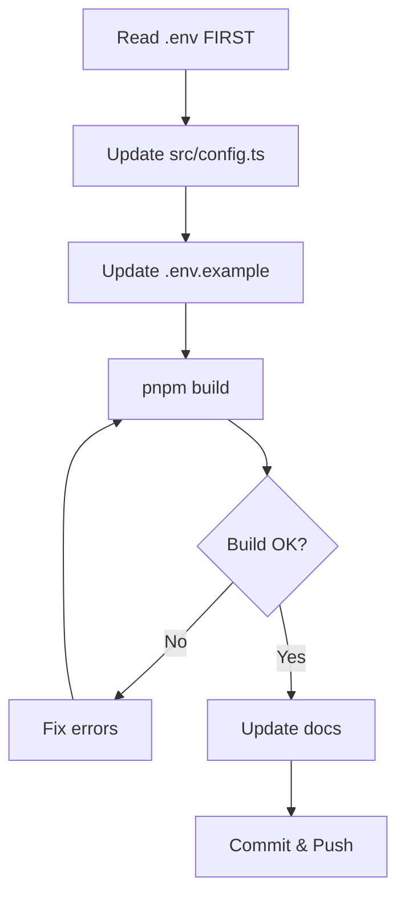
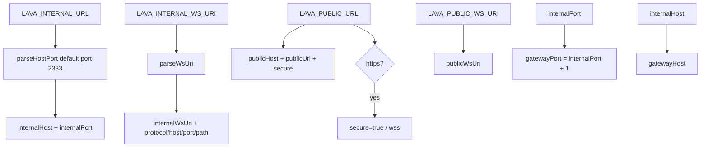

# Config Management Skill



## Purpose
Manage `src/config.ts` and `.env.example`. Configuration is read directly from environment variables — there is NO `application.yml` parsing in TypeScript anymore. `application.yml` is only consumed by the Lavalink Java process itself (Spring `${VAR:default}` placeholders resolved with env vars passed via Docker/supervisor).

## Current Config Architecture

```mermaid
flowchart LR
    subgraph Env[".env File"]
        E1[LAVA_INTERNAL_URL]
        E2[LAVA_PUBLIC_URL]
        E3[LAVA_INTERNAL_WS_URI]
        E4[LAVA_PUBLIC_WS_URI]
        E5[LAVA_PASS]
        E6[LAVA_CIPHER_URL]
        E7[LAVA_CIPHER_PASSWORD]
        E8[YOUTUBE_CLIENT_ID]
        E9[YOUTUBE_CLIENT_SECRET]
        E10[YOUTUBE_REFRESH_TOKEN]
        E11[SPOTIFY_CLIENT_ID]
        E12[SPOTIFY_CLIENT_SECRET]
        E13[GENIUS_ACCESS_TOKEN]
        E14[NODE_ENV]
        E15[DB_URI]
        E16[DB_PATH]
        E17[DASHBOARD_THEME]
        E18[DASHBOARD_COLOR_SCHEME]
    end

    subgraph Config["src/config.ts"]
        C1[env / envInt / envBool helpers]
        C2[parseHostPort / parseWsUri / buildConfig / configure]
    end

    subgraph ServerConfig["ServerConfig Interface"]
        SC1[internalHost / internalPort / internalUrl]
        SC2[internalWsUri / protocol / host / port / path]
        SC3[publicHost / publicUrl / publicWsUri]
        SC4[secure / gatewayHost / gatewayPort]
        SC5[pass / cipherUrl / cipherPassword]
        SC6[youtubeClientId / youtubeClientSecret]
        SC7[spotifyClientId / spotifyClientSecret]
        SC8[geniusToken / dbPath / isProduction]
        SC9[dashboardTheme / dashboardColorScheme]
        SC10[dashboardEnabled / supervisorEnabled / youtubeOAuthEnabled]
    end

    Env --> Config
    Config --> ServerConfig
```



### ServerConfig Interface (src/config.ts)
```typescript
interface ServerConfig {
  internalHost: string;      // from LAVA_INTERNAL_URL (Lavalink node bind host)
  internalPort: number;      // from LAVA_INTERNAL_URL (Lavalink node port)
  internalUrl: string;       // internalHost:internalPort (verbatim)
  internalWsUri: string;     // LAVA_INTERNAL_WS_URI (verbatim, trailing / stripped)
  internalWsProtocol: 'ws' | 'wss'; // parsed from internal WS URI
  internalWsHost: string;    // parsed from internal WS URI
  internalWsPort: number;    // parsed from internal WS URI
  internalWsPath: string;    // parsed from internal WS URI (default /v4/websocket)
  publicHost: string;        // LAVA_PUBLIC_URL scheme stripped
  publicUrl: string;         // LAVA_PUBLIC_URL (verbatim, trailing / stripped)
  publicWsUri: string;       // LAVA_PUBLIC_WS_URI or derived (secure?'wss':'ws')://publicHost/v4/websocket
  secure: boolean;           // true when LAVA_PUBLIC_URL uses https/wss
  gatewayHost: string;       // internalHost (0.0.0.0 when wildcard)
  gatewayPort: number;       // internalPort + 1 (dashboard/gateway bind)
  pass: string;              // LAVA_PASS
  cipherUrl: string;         // LAVA_CIPHER_URL (default https://cipher.kikkia.dev/)
  cipherPassword: string;    // LAVA_CIPHER_PASSWORD
  youtubeClientId: string;   // YOUTUBE_CLIENT_ID
  youtubeClientSecret: string; // YOUTUBE_CLIENT_SECRET
  spotifyClientId: string;   // SPOTIFY_CLIENT_ID
  spotifyClientSecret: string; // SPOTIFY_CLIENT_SECRET
  geniusToken: string;       // GENIUS_ACCESS_TOKEN
  dbPath: string;            // DB_PATH (path.resolve)
  isProduction: boolean;     // NODE_ENV === 'production'
  dashboardTheme: string;    // DASHBOARD_THEME (default 'dark')
  dashboardColorScheme: string; // DASHBOARD_COLOR_SCHEME (default 'default')
  dashboardEnabled: boolean; // false when imported as a library
  supervisorEnabled: boolean; // false to disable Lavalink process supervision
  youtubeOAuthEnabled: boolean; // false to disable the OAuth flow
}
```

### URL Parsing Logic



### Environment Variables (src/config.ts)

Key helpers (no YAML parsing):
- `env(name, fallback)` - Reads `process.env[name]` with fallback
- `envInt(name, fallback)` - Parses integer env var (1..65535)
- `envBool(name, fallback)` - Parses boolean env var
- `parseHostPort(raw, defaultPort)` - Parses `"host:port"` (prefixes `http://` when scheme-less) → `{hostname, port}`
- `parseWsUri(raw, fallbackProtocol, fallbackHostname, fallbackPort, fallbackPath)` - Parses a full WS URI → `{uri, protocol, hostname, port, pathname}`
- `buildConfig(envSource)` - Builds a fresh `ServerConfig` from an env source (defaults `process.env`)
- `configure(overrides, envSource)` - Merges `buildConfig(source)` + overrides into the live `config` export via `Object.assign` (in-place, propagates to all importers)
- Derived: `internalProtocol = internalWsProtocol === 'wss' ? 'https' : 'http'`, `publicUrl` falls back to `internalUrl` when LAVA_PUBLIC_URL empty, public WS derived as `(secure?'wss':'ws')://publicHost/v4/websocket`, `gatewayPort = internalPort + 1`

## .env.example Format
All current valid keys must be documented. See rules.md for complete list. Theme + dashboard section at the bottom:
- `DASHBOARD_THEME="dark"` — glassmorphism | dark | light | cyberpunk | dracula | nord | emerald
- `DASHBOARD_COLOR_SCHEME="default"` — default | cyan | purple | blue | emerald | rose | amber | indigo | crimson | teal | sunset

## application.yml Integration

```mermaid
flowchart LR
    AppYML[application.yml] -->|Spring ${VAR:default}| Lavalink[Lavalink Java Process]
    Env[".env as child env vars"] --> Prov[Supervisor spawns java]
    Prov --> Lavalink
```

- Lavalink JAR reads `application.yml` with Spring-style `${VAR:default}` placeholders
- TypeScript supervisor spawns `java -jar Lavalink.jar` with `-Dserver.port=${config.internalPort}` and `-Dserver.address=${config.internalHost}` and passes `SERVER_PORT`/`PORT` env vars to the child process
- TypeScript config does NOT parse application.yml
- `application.yml` `server.port` placeholder is `${SERVER_PORT:2333}` (supervisor sets `SERVER_PORT`)

## Workflow for Changes
1. Read current `.env` file FIRST
2. Update `src/config.ts` interface and parsing logic
3. Update `.env.example` with all current keys
4. Run `pnpm build` to verify
5. Update documentation (wiki/Configuration.md, wiki/Deployment.md)

## Common Tasks
| Task | Steps |
|------|-------|
| **Add new env var** | Add to config.ts parsing → .env.example → application.yml (if Lavalink needs it) |
| **Remove env var** | Remove from ALL files (config.ts, .env.example, application.yml, docs, rules.md) |
| **Change URL structure** | Update derived internal/public URL logic in config.ts (`parseHostPort`/`parseWsUri`) |
| **New plugin config** | Add to application.yml only (Java side) |

## Validation Checklist
- [ ] Only uses current .env keys (see rules.md)
- [ ] `LAVA_INTERNAL_URL` / `LAVA_PUBLIC_URL` / `LAVA_INTERNAL_WS_URI` / `LAVA_PUBLIC_WS_URI` used; NO `LAVA_DOMAIN`/`LAVA_HOST`/`LAVA_PORT`/`LAVA_SECURE`/`DASHBOARD_*_URL`
- [ ] `REVERSE_PROXY_ENABLED` / `REVERSE_PROXY_TYPE` parsed (config.publicPort / reverseProxyEnabled / reverseProxyType) when masking is supported
- [ ] No references to removed features
- [ ] No hardcoded values
- [ ] No dead code
- [ ] Config matches current .env exactly
- [ ] `pnpm build` passes