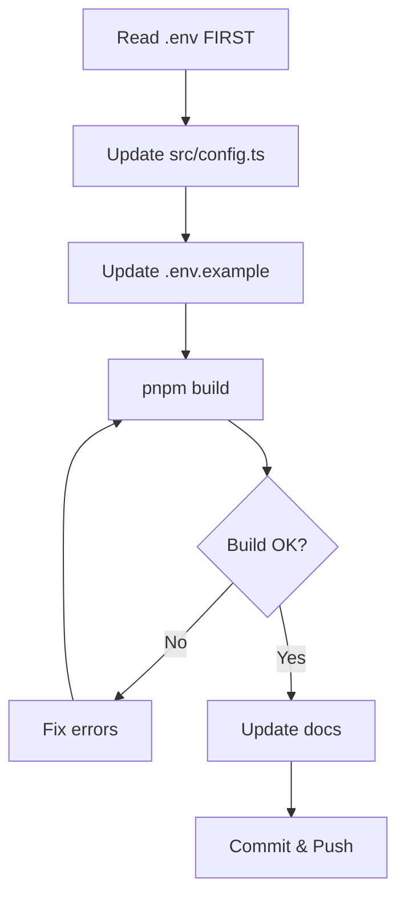
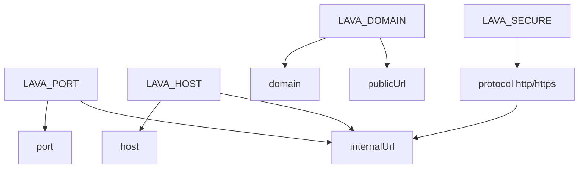

# Config Management Skill



## Purpose
Manage `src/config.ts` and `.env.example`. Configuration is read directly from environment variables — there is NO `application.yml` parsing in TypeScript anymore. `application.yml` is only consumed by the Lavalink Java process itself (Spring `${VAR:default}` placeholders resolved with env vars passed via Docker/supervisor).

## Current Config Architecture

```mermaid
flowchart LR
    subgraph Env[".env File"]
        E1[LAVA_DOMAIN]
        E2[LAVA_HOST]
        E3[LAVA_PORT]
        E4[LAVA_PASS]
        E5[LAVA_SECURE]
        E6[LAVA_CIPHER_URL]
        E6[LAVA_CIPHER_PASSWORD]
        E7[YOUTUBE_CLIENT_ID]
        E8[YOUTUBE_CLIENT_SECRET]
        E8[YOUTUBE_REFRESH_TOKEN]
        E9[SPOTIFY_CLIENT_ID]
        E9[SPOTIFY_CLIENT_SECRET]
        E9[GENIUS_ACCESS_TOKEN]
        E10[NODE_ENV]
        E10[DB_URI]
        E10[DB_PATH]
        E11[DASHBOARD_THEME]
        E11[DASHBOARD_COLOR_SCHEME]
    end

    subgraph Config["src/config.ts"]
        C1[env / envInt / envBool helpers]
        C2[Derived URL builders]
    end

    subgraph ServerConfig["ServerConfig Interface"]
        SC1[port: number]
        SC2[host: string]
        SC3[domain: string]
        SC4[pass: string]
        SC5[secure: boolean]
        SC6[cipherUrl: string]
        SC7[cipherPassword: string]
        SC8[youtubeClientId: string]
        SC9[youtubeClientSecret: string]
        SC10[spotifyClientId: string]
        SC11[spotifyClientSecret: string]
        SC12[geniusToken: string]
        SC13[dbPath: string]
        SC14[isProduction: boolean]
        SC15[dashboardTheme: string]
        SC16[dashboardColorScheme: string]
        SC17[internalUrl: string]
        SC18[publicUrl: string]
    end

    Env --> Config
    Config --> ServerConfig
```



### ServerConfig Interface (src/config.ts)
```typescript
interface ServerConfig {
  port: number;              // LAVA_PORT (dashboard on /dashboard)
  host: string;              // LAVA_HOST (bind address)
  domain: string;            // LAVA_DOMAIN (public domain)
  pass: string;              // LAVA_PASS
  secure: boolean;           // LAVA_SECURE (true/false)
  cipherUrl: string;         // LAVA_CIPHER_URL (default https://cipher.kikkia.dev/)
  cipherPassword: string;    // LAVA_CIPHER_PASSWORD
  youtubeClientId: string;   // YOUTUBE_CLIENT_ID
  youtubeClientSecret: string; // YOUTUBE_CLIENT_SECRET
  spotifyClientId: string;   // SPOTIFY_CLIENT_ID
  spotifyClientSecret: string; // SPOTIFY_CLIENT_SECRET
  geniusToken: string;       // GENIUS_ACCESS_TOKEN
  dbPath: string;            // DB_PATH (path.resolve)
  isProduction: boolean;     // NODE_ENV === 'production'
  dashboardTheme: string;    // DASHBOARD_THEME (default 'dark')
  dashboardColorScheme: string; // DASHBOARD_COLOR_SCHEME (default 'default')
  internalUrl: string;       // http(s)://host:port
  publicUrl: string;         // https://domain (or http(s)://host:port if localhost)
}
```

### URL Parsing Logic



### Environment Variables (src/config.ts)

Key helpers (no YAML parsing):
- `env(name, fallback)` - Reads `process.env[name]` with fallback
- `envInt(name, fallback)` - Parses integer env var
- `envBool(name, fallback)` - Parses boolean env var
- Derived: `internalUrl = ${protocol}://${host}:${port}`, `publicUrl` from LAVA_DOMAIN (falls back to `http://host:port` when domain is localhost)

## .env.example Format
All current valid keys must be documented. See rules.md for complete list. Theme section at the bottom:
- `DASHBOARD_THEME="dark"` — glassmorphism | dark | light | cyberpunk | dracula | nord | emerald
- `DASHBOARD_COLOR_SCHEME="default"` — default | cyan | purple | blue | emerald | rose | amber | indigo | crimson | teal | sunset

## application.yml Integration

```mermaid
flowchart LR
    AppYML[application.yml] -->|Spring ${VAR:default}| Lavalink[Lavalink Java Process]
    Env[".env as child env vars"] --> Prov[Supervisor spawns java]
    Prov --> Lavalink
```

- Lavalink JAR reads `application.yml` with Spring-style `${VAR:default}` placeholders
- TypeScript supervisor spawns `java -jar Lavalink.jar` with `-Dserver.port=${config.port}` and `-Dserver.address=${config.host}` and passes relevant env vars to the child process
- TypeScript config does NOT parse application.yml

## Workflow for Changes
1. Read current `.env` file FIRST
2. Update `src/config.ts` interface and parsing logic
3. Update `.env.example` with all current keys
4. Run `pnpm build` to verify
5. Update documentation (wiki/Configuration.md, wiki/Deployment.md)

## Common Tasks
| Task | Steps |
|------|-------|
| **Add new env var** | Add to config.ts parsing → .env.example → application.yml (if Lavalink needs it) |
| **Remove env var** | Remove from ALL files (config.ts, .env.example, application.yml, docs, rules.md) |
| **Change URL structure** | Update derived `internalUrl`/`publicUrl` logic in config.ts |
| **New plugin config** | Add to application.yml only (Java side) |

## Validation Checklist
- [ ] Only uses current .env keys (see rules.md)
- [ ] No references to removed features
- [ ] No hardcoded values
- [ ] No dead code
- [ ] Config matches current .env exactly
- [ ] `pnpm build` passes