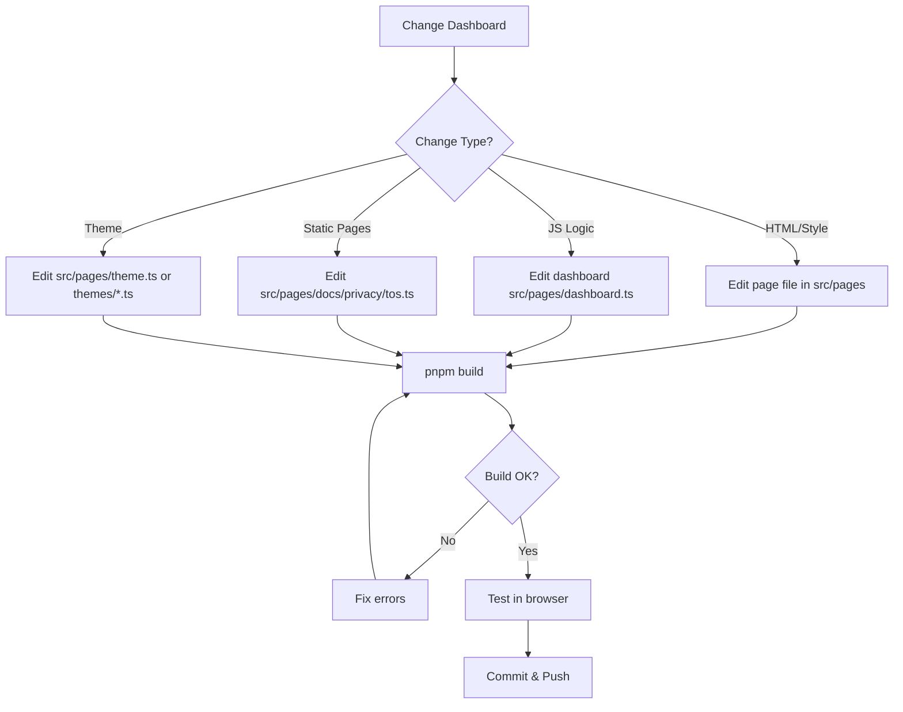

# Dashboard Development Skill



## Purpose
Manage the dashboard and static pages. All dashboard code lives under `src/pages/` — one file per page, with a shared layout and a pluggable theme system.

## Current Dashboard Structure

```mermaid
flowchart TD
    subgraph Pages["src/pages/"]
        Dash[src/pages/dashboard.ts<br/>renderDashboardHtml()]
        Docs[src/pages/docs.ts<br/>renderDocsHtml()]
        Privacy[src/pages/privacy.ts<br/>renderPrivacyHtml()]
        TOS[src/pages/tos.ts<br/>renderTosHtml()]
        Layout[src/pages/layout.ts<br/>renderPage()]
        Theme[src/pages/theme.ts<br/>theme registry]
    end

    subgraph Themes["src/pages/themes/"]
        Shared[shared.ts<br/>baseStyles + color scheme overrides]
        T1[dark.ts / light.ts / glassmorphism.ts<br/>cyberpunk.ts / dracula.ts / nord.ts / emerald.ts]
    end

    Layout --> Theme
    Theme --> Themes
    Dash --> Layout
    Docs --> Layout
    Privacy --> Layout
    TOS --> Layout

    Server[src/server.ts] -->|Routes| Dash
    Server -->|Routes| Docs
    Server -->|Routes| Privacy
    Server -->|Routes| TOS

    Index[src/pages/index.ts<br/>barrel export] --> Dashboard
```

## Current Implementation

### Main Dashboard (`src/pages/dashboard.ts` → `renderDashboardHtml()`)
- **HTML**: Status card, connection details, YouTube OAuth panel, metrics chart, system events list
- **JS**: Polls `/api/status` every 5s, `/api/metrics` every 30s; chart reads CSS vars via `getComputedStyle`
- Uses theme CSS variables (`--card-inner`, `--border`, `--emerald`/`--amber`/`--red`, `--primary`)

### Shared Layout (`src/pages/layout.ts` → `renderPage(title, content)`)
- Full HTML shell with `<html class="${theme.id} scheme-${scheme.id}">`
- Injects `getThemeCss()` + `getBaseStyles()` + layout CSS (all driven by theme vars)
- Header brand icon + nav to `/`, `/docs`, `/privacy`, `/tos`
- Footer with websocket URL (from `config.secure` / `config.domain` / `config.port`)

### Theme System (`src/pages/theme.ts` + `src/pages/themes/*.ts`)
- `getThemeInfo(theme)` → `{id, name, icon}` (glass/glassmorphism, light, cyberpunk, dracula, nord, emerald, default dark)
- `getColorSchemeInfo(scheme)` → 10 accent schemes (purple, blue, emerald, rose, amber, indigo, crimson, teal, sunset, cyan) + default
- `getThemeCss()` concatenates all themes + color scheme mode + overrides
- `getBaseStyles()` shared base CSS
- Selected via `config.dashboardTheme` / `config.dashboardColorScheme` (from `.env`)

### Static Pages
- `src/pages/docs.ts` → `/docs`
- `src/pages/privacy.ts` → `/privacy`
- `src/pages/tos.ts` → `/tos`
- All use `renderPage()` with `.card` / `.section-title` / `.section-desc` classes and `var(--border)` list styling

## Configuration Usage (from src/config.ts)
```typescript
config.secure       // boolean, LAVA_SECURE
config.domain       // string, LAVA_DOMAIN (scheme stripped)
config.port         // number, LAVA_PORT
config.pass         // string, LAVA_PASS
config.publicUrl    // http(s)://domain (Lavalink public)
config.internalUrl  // http://host:port (Lavalink internal)
config.dashboardPort        // number, from DASHBOARD_INTERNAL_URL or LAVA_PORT + 1
config.dashboardInternalUrl // http://<dashboardHost>:<dashboardPort> (gateway bind)
config.dashboardUrl         // DASHBOARD_PUBLIC_URL or http://<dashboardHost>:<dashboardPort>
config.dashboardTheme        // 'dark' | 'light' | 'cyberpunk' | ...
config.dashboardColorScheme  // 'default' | 'purple' | ...
```

### Routes
- `/` - Main dashboard (gateway root)
- `/docs` - Documentation
- `/tos` - Terms of Service
- `/privacy` - Privacy Policy

## Public API Endpoints Used
| Endpoint | Purpose |
|----------|---------|
| `GET /api/status` | Node status, stats, connection info, OAuth state |
| `GET /api/metrics` | Historical performance metrics |
| `GET /api/oauth/youtube/status` | YouTube OAuth status |
| `POST /api/oauth/youtube/start` | Initiate device flow |
| `POST /api/oauth/youtube/manual` | Apply manual token |

## Dashboard JS Key Functions
| Function | Purpose |
|----------|---------|
| `pollStatus()` | Fetches `/api/status` every 5s |
| `pollMetrics()` | Fetches `/api/metrics` every 30s |
| `updateOAuthUi(oauth)` | Updates OAuth panel |
| `startYouTubeOAuth()` | Triggers device flow |
| `formatUptime(seconds)` | Formats uptime string |
| `escapeHtml(str)` | XSS prevention |

## Workflow for Changes
### HTML/Style Changes
1. Edit the relevant page in `src/pages/`
2. Use CSS variables from `src/pages/themes/` (never hardcode colors)
3. Test in browser

### Theme Changes
1. Edit `src/pages/theme.ts` registry or add a theme file in `src/pages/themes/`
2. Theme files export a CSS-string const of theme vars (`--bg`, `--card-bg`, `--card-inner`, `--border`, `--text`, `--primary`, etc.)
3. Color scheme overrides live in `src/pages/themes/shared.ts`

### JS Logic Changes
1. Edit the `<script>` section in `src/pages/dashboard.ts`
2. Add new API calls if needed (update `src/server.ts`)
3. Test polling, OAuth flow, copy buttons

### Static Pages
1. Create the page function in a new file under `src/pages/`
2. Re-export it in `src/pages/index.ts`
3. Add route in `src/server.ts`
4. Update navigation in `src/pages/layout.ts` if needed

## Validation Checklist
- [ ] Uses `config.publicUrl`, `config.internalUrl`, `config.dashboardUrl`, `config.dashboardInternalUrl`, `config.secure`, `config.domain`, `config.port` only (no `lavaPublicUrl`/`lavaInternalUrl`)
- [ ] No `/dashboard` route prefix (dashboard at gateway root `/`, static pages at `/docs`, `/privacy`, `/tos`)
- [ ] Colors come from theme CSS variables, not hardcoded values
- [ ] No references to removed features (keep-alive, admin console, owner login, manual token modal)
- [ ] OAuth UI works with public `/api/oauth/youtube/*` endpoints
- [ ] Public `/api/status` provides connection config
- [ ] `pnpm build` passes
- [ ] Tested in browser (desktop + mobile)