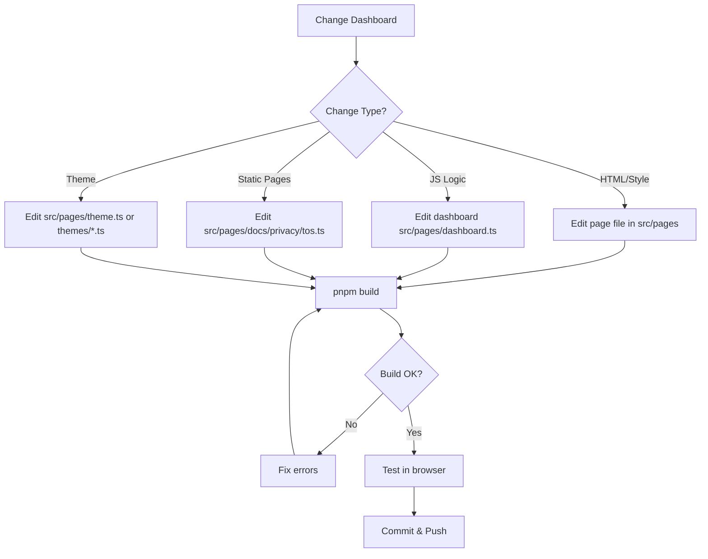

# Dashboard Development Skill



## Purpose
Manage the dashboard and static pages. All dashboard code lives under `src/pages/` — one file per page, with a shared layout and a pluggable theme system. The dashboard is served under the `/dashboard` prefix on the gateway port (`internalPort + 1`).

## Current Dashboard Structure

```mermaid
flowchart TD
    subgraph Pages["src/pages/"]
        Dash[src/pages/dashboard.ts<br/>renderDashboardHtml()]
        Docs[src/pages/docs.ts<br/>renderDocsHtml()]
        Privacy[src/pages/privacy.ts<br/>renderPrivacyHtml()]
        TOS[src/pages/tos.ts<br/>renderTosHtml()]
        Layout[src/pages/layout.ts<br/>renderPage()]
        Theme[src/pages/theme.ts<br/>theme registry]
    end

    subgraph Themes["src/pages/themes/"]
        Shared[shared.ts<br/>baseStyles + color scheme overrides]
        T1[dark.ts / light.ts / glassmorphism.ts<br/>cyberpunk.ts / dracula.ts / nord.ts / emerald.ts]
    end

    Layout --> Theme
    Theme --> Themes
    Dash --> Layout
    Docs --> Layout
    Privacy --> Layout
    TOS --> Layout

    Server[src/server.ts] -->|Routes /dashboard/*| Dash
    Server -->|Routes /dashboard/docs| Docs
    Server -->|Routes /dashboard/privacy| Privacy
    Server -->|Routes /dashboard/tos| TOS

    Index[src/pages/index.ts<br/>barrel export] --> Dashboard
```

## Current Implementation

### Main Dashboard (`src/pages/dashboard.ts` → `renderDashboardHtml()`)
- **HTML**: Status badge, 6 stat cards (players/playing/uptime/memory/cpu/frames), two connection cards (INTERNAL + PUBLIC), metrics chart
- **JS**: `refreshStatus()` polls `/dashboard/api/status` every 5s, `refreshMetrics()` polls `/dashboard/api/metrics` every 30s; chart reads CSS vars via `getComputedStyle`
- **JS**: `EventSource('/dashboard/api/events')` SSE listener re-renders the connection cards in real time (`event: connection`); on error falls back to 5s polling (`sseAvailable = false`)
- Connection cards clearly labeled **INTERNAL** vs **PUBLIC** — internal shows host/port/url/ws uri; public shows host/url/ws uri/secure, a `Port masked — Cloudflare` hint, and a masked password with Show/Hide toggle reading from the API payload
- Uses theme CSS variables (`--card-inner`, `--border`, `--emerald`/`--amber`/`--red`, `--primary`)

### Shared Layout (`src/pages/layout.ts` → `renderPage(title, content)`)
- Full HTML shell with `<html class="${theme.id} scheme-${scheme.id}">`
- Injects `getThemeCss()` + `getBaseStyles()` + layout CSS (all driven by theme vars)
- Header brand icon + nav to `/dashboard`, `/dashboard/docs`, `/dashboard/privacy`, `/dashboard/tos`
- Footer with public websocket URL (from `config.publicWsUri`)
- `/` 302-redirects to `/dashboard`

### Theme System (`src/pages/theme.ts` + `src/pages/themes/*.ts`)
- `getThemeInfo(theme)` → `{id, name, icon}` (glass/glassmorphism, light, cyberpunk, dracula, nord, emerald, default dark)
- `getColorSchemeInfo(scheme)` → 10 accent schemes (purple, blue, emerald, rose, amber, indigo, crimson, teal, sunset, cyan) + default
- `getThemeCss()` concatenates all themes + color scheme mode + overrides
- `getBaseStyles()` shared base CSS
- Selected via `config.dashboardTheme` / `config.dashboardColorScheme` (from `.env`)

### Static Pages
- `src/pages/docs.ts` → `/dashboard/docs`
- `src/pages/privacy.ts` → `/dashboard/privacy`
- `src/pages/tos.ts` → `/dashboard/tos`
- All use `renderPage()` with `.card` / `.section-title` / `.section-desc` classes and `var(--border)` list styling

## Configuration Usage (from src/config.ts)
```typescript
config.internalHost    // string, internal bind host (from LAVA_INTERNAL_URL)
config.internalPort    // number, internal Lavalink port (from LAVA_INTERNAL_URL)
config.internalUrl     // internalHost:internalPort
config.internalWsUri   // LAVA_INTERNAL_WS_URI
config.publicHost      // string, public host (LAVA_PUBLIC_URL scheme stripped)
config.publicUrl       // LAVA_PUBLIC_URL
config.publicWsUri     // LAVA_PUBLIC_WS_URI
config.secure          // boolean, true when public URL is https
config.gatewayHost     // gateway bind host (internalHost, 0.0.0.0 when wildcard)
config.gatewayPort     // gateway/dashboard bind port = internalPort + 1
config.pass            // string, LAVA_PASS
config.dashboardEnabled // boolean, true when standalone; false when imported as library
config.dashboardTheme        // 'dark' | 'light' | 'cyberpunk' | ...
config.dashboardColorScheme  // 'default' | 'purple' | ...
```

### Routes
- `/` - 302 → `/dashboard` (404 JSON when dashboard disabled)
- `/dashboard` - Main dashboard
- `/dashboard/docs` - Documentation
- `/dashboard/tos` - Terms of Service
- `/dashboard/privacy` - Privacy Policy

## Public API Endpoints Used
| Endpoint | Purpose |
|----------|---------|
| `GET /dashboard/api/status` | Node status, stats, connection info (internal/public), OAuth state |
| `GET /dashboard/api/metrics` | Historical performance metrics |
| `GET /dashboard/api/events` | SSE stream (event: `connection`, every 5s) for real-time updates |
| `GET /dashboard/api/oauth/youtube/status` | YouTube OAuth status |
| `POST /dashboard/api/oauth/youtube/start` | Initiate device flow |
| `POST /dashboard/api/oauth/youtube/manual` | Apply manual token |

## Dashboard JS Key Functions
| Function | Purpose |
|----------|---------|
| `refreshStatus()` | Fetches `/dashboard/api/status` every 5s |
| `refreshMetrics()` | Fetches `/dashboard/api/metrics` every 30s |
| `renderConnection(conn)` | Re-renders internal/public connection cards from API data |
| `renderChart()` | Draws player-count metrics chart |
| `updateOAuthUi(oauth)` | Updates OAuth panel |
| `startYouTubeOAuth()` | Triggers device flow |
| `formatUptime(seconds)` | Formats uptime string |
| `escapeHtml(str)` | XSS prevention |

## Workflow for Changes
### HTML/Style Changes
1. Edit the relevant page in `src/pages/`
2. Use CSS variables from `src/pages/themes/` (never hardcode colors)
3. Test in browser

### Theme Changes
1. Edit `src/pages/theme.ts` registry or add a theme file in `src/pages/themes/`
2. Theme files export a CSS-string const of theme vars (`--bg`, `--card-bg`, `--card-inner`, `--border`, `--text`, `--primary`, etc.)
3. Color scheme overrides live in `src/pages/themes/shared.ts`

### JS Logic Changes
1. Edit the `<script>` section in `src/pages/dashboard.ts`
2. Add new API calls if needed (update `src/server.ts`)
3. Test polling/SSE, OAuth flow, copy buttons

### Static Pages
1. Create the page function in a new file under `src/pages/`
2. Re-export it in `src/pages/index.ts`
3. Add route in `src/server.ts`
4. Update navigation in `src/pages/layout.ts` if needed

## Validation Checklist
- [ ] Uses `config.internalHost`, `config.internalPort`, `config.internalUrl`, `config.internalWsUri`, `config.publicUrl`, `config.publicPort`, `config.publicWsUri`, `config.gatewayPort`, `config.pass` — NO old `config.domain`/`config.port`/`config.dashboardUrl`
- [ ] Dashboard routes carry the `/dashboard` prefix (root `/` 302-redirects; static pages at `/dashboard/docs`, `/dashboard/privacy`, `/dashboard/tos`)
- [ ] Connection info shows separated INTERNAL vs PUBLIC cards (public port masked hint driven by `config.reverseProxyEnabled`, proxy type label from `config.reverseProxyType`, port value from `config.publicPort`)
- [ ] Real-time updates via `/dashboard/api/events` SSE with 5s polling fallback
- [ ] Colors come from theme CSS variables, not hardcoded values
- [ ] No references to removed features (keep-alive, admin console, owner login, manual token modal)
- [ ] OAuth UI works with public `/dashboard/api/oauth/youtube/*` endpoints
- [ ] Public `/dashboard/api/status` provides connection config
- [ ] `pnpm build` passes
- [ ] Tested in browser (desktop + mobile)