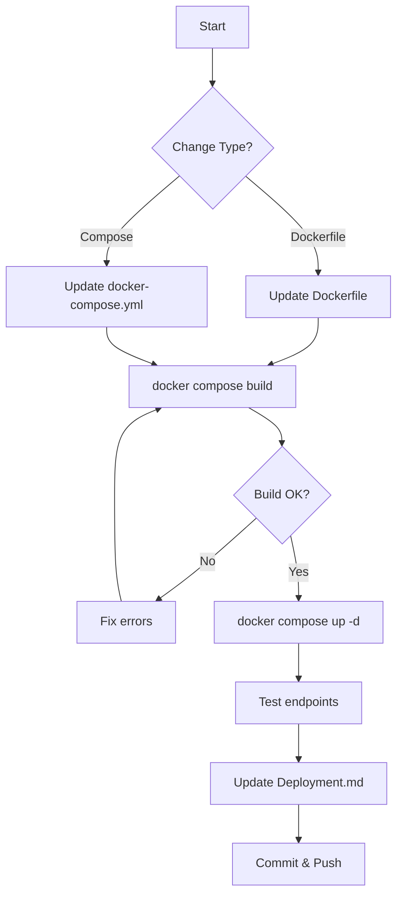

# Docker Deployment Skill



## Purpose
Manage `Dockerfile` and `docker-compose.yml` for containerized deployment.

## Current Dockerfile (Root)

```mermaid
flowchart TD
    Base[FROM eclipse-temurin:21-jre-alpine] --> Install[apk add nodejs npm curl]
    Install --> Workdir[WORKDIR /opt/Lavalink]
    Workdir --> Download[Download Lavalink JAR\nARG LAVALINK_VERSION=latest\ncurl -L -o Lavalink.jar]
    Download --> CopyPkg[COPY package.json]
    CopyPkg --> NpmInstall[RUN npm install]
    NpmInstall --> CopyTS[COPY tsconfig.json]
    CopyTS --> CopySrc[COPY src/]
    CopySrc --> Build[RUN npm run build\nnpm prune --production]
    Build --> CopyYML[COPY application.yml]
    CopyYML --> Expose[EXPOSE 2333]
    Expose --> CMD[CMD ["node", "dist/index.js"]]
```

### Dockerfile (Root)
```dockerfile
FROM eclipse-temurin:21-jre-alpine

# Install nodejs, npm, curl
RUN apk add --no-cache nodejs npm curl

WORKDIR /opt/Lavalink

# Download Lavalink JAR from official releases at build time
ARG LAVALINK_VERSION=latest
RUN curl -L -o Lavalink.jar "https://github.com/lavalink-devs/Lavalink/releases/${LAVALINK_VERSION}/download/Lavalink.jar"

# Install dependencies and build ESM TypeScript dashboard & supervisor
COPY package.json ./
RUN npm install

COPY tsconfig.json ./
COPY src/ ./src/
RUN npm run build && npm prune --production

# Copy configuration
COPY application.yml ./application.yml

# Expose Lavalink port
EXPOSE 2333

# Start the ESM TypeScript dashboard and supervisor
CMD ["node", "dist/index.js"]
```

## Current docker-compose.yml (Root)

```mermaid
flowchart LR
    subgraph Compose["docker-compose.yml"]
        Service[service: lavalink] --> Build[build: .]
        Service --> Restart[restart: unless-stopped]
        Service --> Ports[ports:\n- "${LAVA_PORT:-2333}:2333"]
        Service --> Env[environment: 18 vars]
        Service --> Volumes[volumes:\n- ./data:/opt/Lavalink/data]
    end

    subgraph EnvVars["Environment Variables"]
        E1[LAVA_DOMAIN]
        E2[LAVA_HOST]
        E3[LAVA_PORT]
        E4[LAVA_PASS]
        E4[LAVA_SECURE]
        E5[LAVA_CIPHER_URL]
        E6[LAVA_CIPHER_PASSWORD]
        E6[YOUTUBE_CLIENT_ID]
        E7[YOUTUBE_CLIENT_SECRET]
        E7[YOUTUBE_REFRESH_TOKEN]
        E8[SPOTIFY_CLIENT_ID]
        E9[SPOTIFY_CLIENT_SECRET]
        E10[GENIUS_ACCESS_TOKEN]
        E11[DB_PATH]
        E11[DB_URI]
        E12[DASHBOARD_THEME]
        E12[DASHBOARD_COLOR_SCHEME]
        E13[NODE_ENV]
    end
```

### docker-compose.yml (Root)
```yaml
version: '3.8'

services:
  lavalink:
    build: .
    restart: unless-stopped
    ports:
      - "${LAVA_PORT:-2333}:2333"
    environment:
      - PUBLIC_URL=${PUBLIC_URL:-}
      - LAVA_HOST=${LAVA_HOST:-127.0.0.1}
      - LAVA_PORT=${LAVA_PORT:-2333}
      - LAVA_PASS=${LAVA_PASS:-youshallnotpass}
      - LAVA_SECURE=${LAVA_SECURE:-false}
      - LAVA_CIPHER_URL=${LAVA_CIPHER_URL:-https://cipher.kikkia.dev/}
      - LAVA_CIPHER_PASSWORD=${LAVA_CIPHER_PASSWORD:-}
      - YOUTUBE_CLIENT_ID=${YOUTUBE_CLIENT_ID:-}
      - YOUTUBE_CLIENT_SECRET=${YOUTUBE_CLIENT_SECRET:-}
      - YOUTUBE_REFRESH_TOKEN=${YOUTUBE_REFRESH_TOKEN:-}
      - SPOTIFY_CLIENT_ID=${SPOTIFY_CLIENT_ID:-}
      - SPOTIFY_CLIENT_SECRET=${SPOTIFY_CLIENT_SECRET:-}
      - GENIUS_ACCESS_TOKEN=${GENIUS_ACCESS_TOKEN:-}
      - DB_PATH=${DB_PATH:-./database.db}
      - DB_URI=${DB_URI:-sqlite://./database.db}
      - NODE_ENV=${NODE_ENV:-production}
    volumes:
      - ./data:/opt/Lavalink/data
```

## Key Points

### Lavalink JAR
```mermaid
flowchart LR
    Build[Docker Build] -->|ARG LAVALINK_VERSION=latest| Download[curl -L -o Lavalink.jar]
    Download -->|https://github.com/lavalink-devs/Lavalink/releases/${LAVALINK_VERSION}/download/Lavalink.jar| JAR[Lavalink.jar]
    JAR --> Image[Docker Image]
    
    Note1[NOT committed to repo]
    Note2[Downloaded at build time]
    Note3[Version via LAVALINK_VERSION arg]
```

- **NOT committed to repo** - downloaded at build time from official releases
- Version controlled via `LAVALINK_VERSION` build arg (default: `latest`)
- Download URL: `https://github.com/lavalink-devs/Lavalink/releases/${LAVALINK_VERSION}/download/Lavalink.jar`

### Ports
- Lavalink port (2333) exposed
- Dashboard runs on `LAVA_PORT + 1` (2334) via `/dashboard` endpoint
- Users with a custom `LAVA_PORT` manually add the dashboard port mapping (e.g. `2335:2335` for LAVA_PORT=2334)

### Environment Variables in Compose
All valid `.env` keys mapped. See rules.md for current list.

### Volumes
- `./data:/opt/Lavalink/data` - SQLite database persistence

## Workflow for Changes
1. Update `Dockerfile` if base image, build process, or JAR download changes
2. Update `docker-compose.yml` if ports, env vars, or volumes change
3. **Always test**: `docker compose build && docker compose up -d`
4. Update Deployment.md with new instructions

## Common Tasks
| Task | Steps |
|------|-------|
| **Update Lavalink version** | Change `LAVALINK_VERSION` arg or use specific version |
| **Add new env var** | Add to docker-compose.yml environment section |
| **Change base image** | Update `FROM` line in Dockerfile |
| **Add build dependencies** | Add to `apk add` line |

## Validation Checklist
- [ ] Lavalink JAR downloads from official releases
- [ ] Only port 2333 exposed
- [ ] All valid `.env` keys in compose environment
- [ ] Volume for SQLite persistence
- [ ] `docker compose build && docker compose up -d` works
- [ ] Deployment.md updated