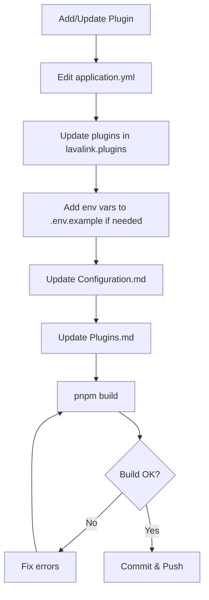
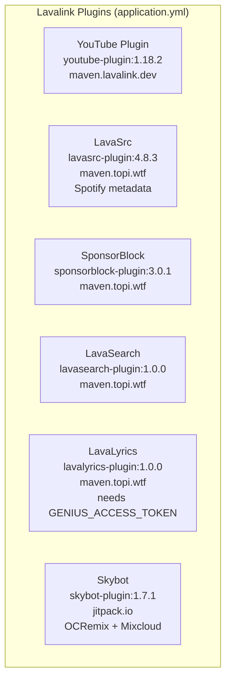

# Plugin Management Skill



## Purpose
Manage Lavalink plugins in `application.yml` and document them in wiki/Plugins.md.

## Current Plugins (application.yml)



### Current Plugin Configuration (application.yml)

```yaml
lavalink:
  plugins:
    - dependency: "dev.lavalink.youtube:youtube-plugin:1.18.2"
      repository: "https://maven.lavalink.dev/releases"
    - dependency: "com.github.topi314.lavasrc:lavasrc-plugin:4.8.3"
      repository: "https://maven.topi.wtf/releases"
      snapshot: false
    - dependency: "com.github.topi314.sponsorblock:sponsorblock-plugin:3.0.1"
      repository: "https://maven.topi.wtf/releases"
      snapshot: false
    - dependency: "com.github.topi314.lavasearch:lavasearch-plugin:1.0.0"
      repository: "https://maven.topi.wtf/releases"
      snapshot: false
    - dependency: "com.github.topi314.lavalyrics:lavalyrics-plugin:1.0.0"
      repository: "https://maven.topi.wtf/releases"
      snapshot: false
    - dependency: "com.github.DuncteBot.skybot:skybot-lavalink-plugin:1.7.1"
      repository: "https://jitpack.io"

plugins:
  youtube:
    enabled: true
    oauth:
      enabled: true
      refreshToken: "${YOUTUBE_REFRESH_TOKEN:}"
      skipInitialization: "true"
    remoteCipher:
      url: "${LAVA_CIPHER_URL:https://cipher.kikkia.dev/}"
      password: "${LAVA_CIPHER_PASSWORD:}"
    clients:
      - TV
      - MUSIC
      - ANDROID_VR
      - IOS
      - WEB
      - WEBEMBEDDED
  lavasrc:
    providers:
      - "ytmsearch:\"%ISRC%\""
      - "ytsearch:\"%ISRC%\""
      - "ytmsearch:%QUERY%"
      - "ytsearch:%QUERY%"
      - "scsearch:%QUERY%"
    sources:
      spotify: true
      soundcloud: false
    spotify:
      clientId: "${SPOTIFY_CLIENT_ID:}"
      clientSecret: "${SPOTIFY_CLIENT_SECRET:}"
      countryCode: "US"
      playlistLoadLimit: 6
      albumLoadLimit: 6
      resolveArtistsInSearch: true
  lavalyrics:
    enabled: true
    geniusToken: "${GENIUS_ACCESS_TOKEN:}"
  skybot:
    sources:
      getyarn: false
      tts: false
      pornhub: false
      reddit: false
      ocremix: true
      tiktok: false
      mixcloud: true
      soundgasm: false
      pixeldrain: false
      tumblr: false
```

## Plugin Details

| Plugin | Dependency | Repository | Config Section | Env Vars |
|--------|------------|------------|----------------|----------|
| YouTube | `dev.lavalink.youtube:youtube-plugin:1.18.2` | maven.lavalink.dev | `plugins.youtube` | `YOUTUBE_CLIENT_ID`, `YOUTUBE_CLIENT_SECRET`, `YOUTUBE_REFRESH_TOKEN`, `LAVA_CIPHER_URL`, `LAVA_CIPHER_PASSWORD` |
| LavaSrc | `com.github.topi314.lavasrc:lavasrc-plugin:4.8.3` | maven.topi.wtf | `plugins.lavasrc` | `SPOTIFY_CLIENT_ID`, `SPOTIFY_CLIENT_SECRET` |
| SponsorBlock | `com.github.topi314.sponsorblock:sponsorblock-plugin:3.0.1` | maven.topi.wtf | (auto) | None |
| LavaSearch | `com.github.topi314.lavasearch:lavasearch-plugin:1.0.0` | maven.topi.wtf | (auto) | None |
| LavaLyrics | `com.github.topi314.lavalyrics:lavalyrics-plugin:1.0.0` | maven.topi.wtf | `plugins.lavalytics` | `GENIUS_ACCESS_TOKEN` |
| Skybot | `com.github.DuncteBot.skybot:skybot-lavalink-plugin:1.7.1` | jitpack.io | `plugins.skybot` | None |

## Workflow for Changes

1. Edit `application.yml` - add/update plugin in `lavalink.plugins`
2. Add plugin config under `plugins:` if needed
3. Add any new env vars to `.env.example`
4. Update `wiki/Plugins.md` with plugin documentation
4. Update `wiki/Configuration.md` if new env vars
5. Run `pnpm build` to verify
6. Update `wiki/Configuration.md` if needed
7. Commit & Push

## Adding a New Plugin

1. Add to `lavalink.plugins` in `application.yml`:
   ```yaml
   - dependency: "group:artifact:version"
     repository: "https://repository.url"
     snapshot: false
   ```
2. Add config under `plugins:` if plugin needs it:
   ```yaml
   plugins:
     pluginname:
       enabled: true
       someSetting: "${ENV_VAR:default}"
   ```
3. Add env var to `.env.example` if needed
4. Document in `wiki/Plugins.md`

## Removing a Plugin

1. Remove from `lavalink.plugins` in `application.yml`
2. Remove config under `plugins:`
3. Remove env vars from `.env.example`
4. Remove documentation from `wiki/Plugins.md`
5. Remove from `wiki/Configuration.md`

## Updating Plugin Version

1. Update version in `lavalink.plugins` dependency
2. Check changelog for breaking changes
3. Update config if schema changed
4. Update documentation

## Validation Checklist
- [ ] Plugin added to `lavalink.plugins` with correct coordinates
- [ ] Repository URL is correct
- [ ] Config section uses `${VAR:default}` for env vars
- [ ] New env vars added to `.env.example`
- [ ] `wiki/Plugins.md` updated
- [ ] `wiki/Configuration.md` updated if new env vars
- [ ] `pnpm build` passes