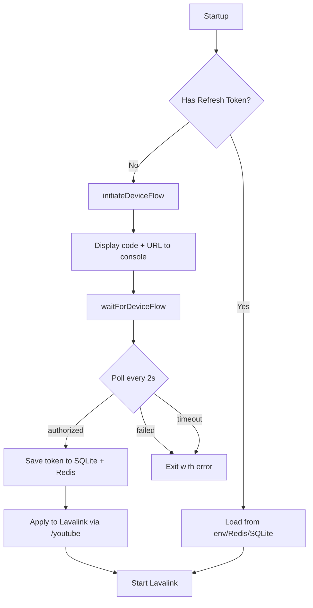
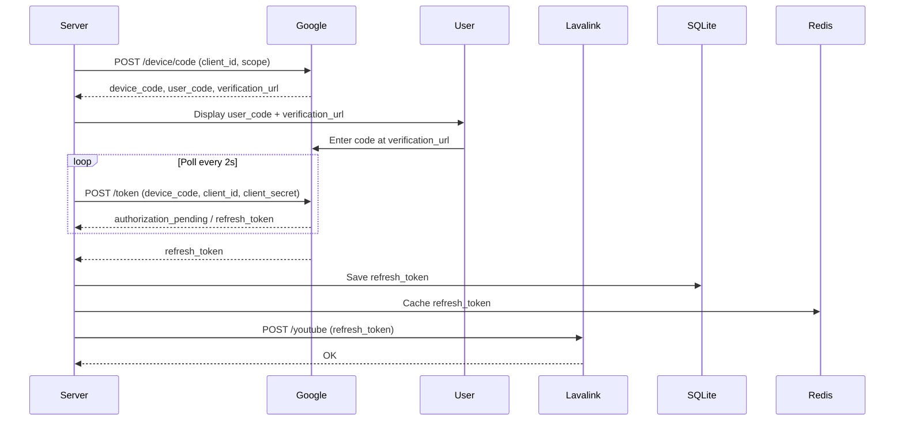

# YouTube OAuth Skill

## Purpose
Manage YouTube OAuth device flow in `src/youtubeOAuth.ts`.

## Current Flow

## Key Functions (src/youtubeOAuth.ts)

| Function | Purpose |
|----------|---------|
| `loadSavedOAuthToken()` | Load token from env → Redis → SQLite (priority order) |
| `initiateDeviceFlow()` | Start device flow, display code/URL to console |
| `waitForDeviceFlow(timeoutMs?)` | Poll until authorized/failed/timed out |
| `saveYouTubeRefreshToken(token)` | Save to SQLite + Redis + apply to Lavalink |
| `applyManualToken(token)` | Manually apply refresh token |
| `getOAuthState()` | Get current OAuth status |

## Environment Variables Used
- `YOUTUBE_CLIENT_ID` - REQUIRED (OAuth Client ID, "TVs and Limited Input devices")
- `YOUTUBE_CLIENT_SECRET` - Client Secret for token exchange
- `YOUTUBE_REFRESH_TOKEN` - Pre-authorized token (optional)

## Device Flow Endpoints
- Primary: `https://www.youtube.com/o/oauth2/device/code`
- Fallback: `https://oauth2.googleapis.com/device/code`
- Token: `https://www.youtube.com/o/oauth2/token`

## Scope
`http://gdata.youtube.com https://www.googleapis.com/auth/youtube`

## Built-in Client Secret Fallback
`SboVhoG9s0rNafixCSGGKXAT` (used when `YOUTUBE_CLIENT_SECRET` not set)

## Public API Endpoints
- `GET /api/oauth/youtube/status` - Get current OAuth state
- `POST /api/oauth/youtube/start` - Initiate device flow
- `POST /api/oauth/youtube/manual` - Apply manual refresh token

## Dashboard Integration
- Shows authorization code/URL on public dashboard banner
- Owner can trigger re-authorization via dashboard
- Manual token entry available

## Workflow for Changes

1. Edit `src/youtubeOAuth.ts` for flow logic changes
2. Update `src/proxy.ts` API endpoints if needed
3. Update `src/dashboard.ts` for UI changes
4. Test: Start server without token → verify device flow
5. Test: Start server with token → verify auto-load

## Validation Checklist
- [ ] Uses `YOUTUBE_CLIENT_ID` and `YOUTUBE_CLIENT_SECRET`
- [ ] Device flow polls every 2 seconds
- [ ] Token saved to SQLite + Redis
- [ ] Public API endpoints work
- [ ] Dashboard shows authorization UI
- [ ] `pnpm build` passes