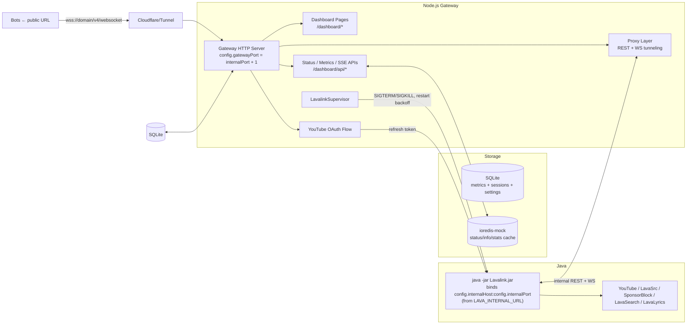

# 🧩 Server Architecture

This page describes the server's key components, how they interact, and the design principles that guide development.

---

## 1. High-Level Diagram

---

## 2. Components

### `src/config.ts` — Configuration
- Parses `LAVA_INTERNAL_URL`, `LAVA_PUBLIC_URL`, `LAVA_INTERNAL_WS_URI`, `LAVA_PUBLIC_WS_URI` and all other env vars into a typed `ServerConfig`.
- `buildConfig(envSource)` builds a fresh config; `configure(overrides, envSource)` merges into the **same shared object** so every importer sees the change instantly (used by the library API).
- Derives: `gatewayPort = internalPort + 1`, upstream WS target from `LAVA_INTERNAL_WS_URI`, public host/secure from `LAVA_PUBLIC_URL`.
- Feature flags: `dashboardEnabled`, `supervisorEnabled`, `youtubeOAuthEnabled`.

### `src/app.ts` — Library Entry
- Exports `config`, `configure`, `buildConfig`, `LavalinkSupervisor`, `createProxyServer`, `startServer`, `LavalinkConfigError`, and the public types.
- `startServer()` validates config (`YOUTUBE_CLIENT_ID`, `Lavalink.jar`), initializes storage, runs the OAuth device flow if needed, starts the supervisor, and returns a `ServerHandle`. It **throws** instead of `process.exit`.

### `src/index.ts` — Standalone Entry
- Loads `dotenv/config`, calls `startServer({ features: { dashboard: true } })`, binds the gateway to `gatewayHost:gatewayPort`, installs SIGINT/SIGTERM handlers, and auto-detects execution vs. import.

### `src/supervisor.ts` — `LavalinkSupervisor`
- Spawns `java ... -Dserver.port=${internalPort} -Dserver.address=${internalHost} -jar Lavalink.jar` with `PORT`/`SERVER_PORT` env set.
- Watches stdout for "ready" and intercepted YouTube OAuth tokens; stderr forwarded.
- On process close: exponential restart backoff (`min(1000 * 2^count, 30000)`, max 10 attempts), then marks node `offline`.
- Polls `/v4/stats` every 5s (updates cache) and snapshots metrics to SQLite every 60s.

### `src/server.ts` — Gateway & Proxy
- Serves `/dashboard`, static pages, status/metrics/SSE APIs, `/health`.
- `proxyHttpRequest` fans REST (`/server/*`, `/v4/*`, `/version`, `/youtube*`) to `internalWsHost:internalWsPort`.
- `handleWebSocketProxy` tunnels `/v4/websocket` (+ `/server/v4/websocket`) bidirectionally, tracks client sessions, and pings every 30s.
- Gated by `config.dashboardEnabled` and `config.youtubeOAuthEnabled`.

### `src/youtube-oauth.ts` — OAuth Device Flow
- Loads saved token (`YOUTUBE_REFRESH_TOKEN` env → Redis → SQLite), initiates the Google device grant, waits for authorization (10 min), and pushes the refresh token to Lavalink (`POST /youtube` to internal node).

### `src/db.ts` — SQLite persistence
- `initDatabase()` creates the schema; stores `metrics_history`, `client_sessions`, `system_events`, and `system_settings` (OAuth tokens).
- Exposes metrics snapshots, session tracking, and system settings helpers.

### `src/redis.ts` — in-memory state
- `ioredis-mock` singleton caching node status/info/stats/log lines and recent events.

### `src/pages/*` — Dashboard
- `layout.ts` shell, `dashboard.ts` page (status + separated internal/public connection cards + metrics chart + SSE), `theme.ts`/`themes/*` theme system, static `docs`/`privacy`/`tos` pages.

---

## 3. Request Flow

1. **HTTP:** Client → `GET /v4/info` → gateway → `proxyHttpRequest` (host = `internalWsHost`, port = `internalWsPort`, `Host` header rewritten) → Java node → response returned.
2. **WebSocket:** Client connects to `/v4/websocket` → gateway `upgrade` handler → target `ws://internalWsHost:internalWsPort/v4/websocket` → bidirectional pipe + keepalive pings + session logging.
3. **Dashboard:** Browser → `/dashboard/api/status` (every 5s) + `/dashboard/api/events` (SSE) + `/dashboard/api/metrics` (every 30s) → live re-render of connection cards/stat cards/chart.

---

## 4. Design Principles

- **Configuration over code:** everything bindable/visible comes from `ServerConfig`; no hardcoded hosts, ports, or secrets.
- **Loose coupling:** components communicate through the shared `config` object, Redis state cache, and SQLite — not direct imports between subsystems.
- **Separation of concerns:** `supervisor` (process lifecycle), `server` (transport), `pages` (presentation), `config` (settings), `db`/`redis` (state) each own a single responsibility.
- **Controllable embedding:** feature toggles + `configure()` make the same codebase work standalone or as a library without forks.
- **Graceful degradation:** node `offline` → `/health` 503 → load balancers reroute; supervisor restart backoff; SSE with polling fallback.
- **TypeScript strict + ESM:** `strict` mode, NodeNext resolution, `.js` extension imports.