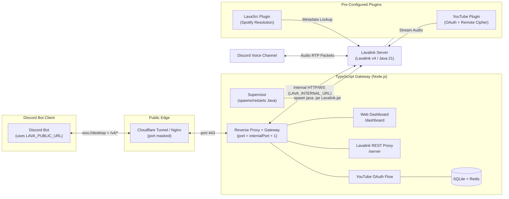

# 🔊 Lavalink v4 Server Documentation

Welcome to the official documentation for the **HELIX-Origin Lavalink v4 Server**.

This project provides a pre-tuned, containerized **Lavalink v4** audio node with an ESM TypeScript dashboard and process supervisor, optimized for dedicated Linux VPS environments and self-hosted Docker installations.

---

> [!NOTE]
> **Hosted / Self-Hosted Only.** This project runs on hardware you control — a dedicated Linux VPS, a local server, or your own network. Cloud PaaS deployment has been removed; shared datacenter IP ranges are aggressively blocked by YouTube's anti-scraping systems.

---

## ⚡ Overview & Purpose

Discord music bots require significant CPU and networking resources to stream and transcode high-bitrate audio packets over WebRTC voice connections. Running an internal audio node inside the same process as your bot quickly leads to **Out-Of-Memory (OOM)** errors, Gateway lag, and audio skipping.

This standalone repository solves that problem by packaging Lavalink v4 in an isolated, lightweight container with an integrated TypeScript supervisor:
- **Official Lavalink JAR:** Download the latest Lavalink v4 JAR from the [official releases](https://github.com/lavalink-devs/Lavalink/releases) (not committed to repo).
- **Interactive Web Dashboard:** Modern themed status dashboard at `/dashboard` with real-time player telemetry, node statistics, and clear internal/public connection panels backed by Server-Sent Events.
- **Pre-Configured Plugins:** Out-of-the-box support for the official **YouTube Plugin** (with remote deciphering and OAuth), **LavaSrc** (Spotify metadata resolution), **SponsorBlock** (auto-skip sponsorships), **LavaSearch** (enhanced search), and **LavaLyrics** (Genius lyrics).
- **Two-Network Connection Model:** `LAVA_INTERNAL_URL` + `LAVA_PUBLIC_URL` cleanly separate bind-level internals from Cloudflare/tunnel-facing publics. Public ports are **masked**; bots use the public URL as-is and append the endpoint.
- **Environment Variable Mapping:** All `application.yml` properties dynamically read from environment variables, eliminating the need to rebuild images to change settings.
- **In-Memory & Persistent Caching:** In-memory caching with Redis (mock) and persistence in SQLite for authentication tokens and system configurations across restarts.
- **YouTube OAuth Device Flow:** Server waits for OAuth authorization before starting Lavalink, ensuring YouTube playback works on first run.
- **Importable as a Library:** Embeddable via Git submodule — the host project supplies its own UI, config overrides, and feature toggles.

---

## 🧭 Architecture

- The **gateway** binds `internalPort + 1` and serves the dashboard (`/dashboard`), static pages (`/dashboard/docs`, `/dashboard/privacy`, `/dashboard/tos`), status APIs, the Lavalink REST proxy (`/server`, `/v4/*`), and the WebSocket proxy (`/v4/websocket`).
- The **supervisor** spawns the Java process (`java -jar Lavalink.jar`), restarting it with exponential backoff on crash, and streams its logs/captured OAuth tokens into the gateway.
- See the [Architecture page](Architecture) for a detailed component breakdown.

---

## 📖 Wiki Table of Contents

### 🚀 Getting Started
- [Deployment Guide](Deployment) — Docker Compose, VPS, systemd, Nginx/Cloudflare.
- [Configuration Reference](Configuration) — environment variables, `application.yml`, URL structure & routing.

### 🔌 Features & Extensibility
- [Plugins Guide](Plugins) — YouTube OAuth/cipher, Spotify, SponsorbBlock, LavaSearch, LavaLyrics.
- [Importing as a Library](Importing) — embed via Git submodule, feature toggles, config overrides.
- [Themes](Themes) — creating and customizing dashboard themes.
- [Modules](Modules) — what counts as a module and how to configure them.
- [Plugin Development](Plugin-Development) — creating and integrating dashboard plugins.

### 🛠️ Maintenance & Support
- [Architecture](Architecture) — components, interactions, design principles.
- [API Reference](API) — HTTP/SSE/WebSocket endpoints, request/response formats, auth.
- [Security](Security) — securing the server and protecting credentials.
- [Performance](Performance) — monitoring, tuning, and optimizing.
- [Testing & Debugging](Testing) — writing and running tests, troubleshooting.
- [Migration Guide](Migration) — upgrading from previous versions / old environment scheme.
- [Troubleshooting & FAQ](Troubleshooting) — common connection/YouTube/theme/plugin issues.
- [Contributing](Contributing) — bug reports, feature requests, pull requests.
- [Code Review](Code-Review) — how contributions are evaluated and merged.
- [Versioning](Versioning) — versioning and release management.
- [Development Guide](Development) — structure, coding standards, dev environment.

### 📦 Repository
- [GitHub Repository](https://github.com/HELIX-Origin/Lavalink-Server)