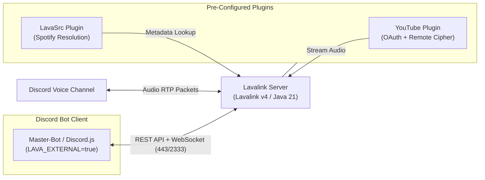

# 🔊 Lavalink v4 Cloud Server Documentation

Welcome to the official documentation for the **HELIX-Origin Lavalink v4 Cloud Server**.

This project provides a pre-tuned, containerized **Lavalink v4** audio node optimized for zero-cost deployment on modern cloud platforms (Render, Railway, Heroku, and Fly.io) as well as dedicated VPS environments.

---

## ⚡ Overview & Purpose

Discord music bots require significant CPU and networking resources to stream and transcode high-bitrate audio packets over WebRTC voice connections. Running an internal audio node inside the same process as your bot on free cloud tiers (like Render or Railway) quickly leads to **Out-Of-Memory (OOM)** errors and Gateway lag.

This standalone repository solves that problem by packaging Lavalink v4 in an isolated, lightweight container image:
- **Always Up-To-Date:** Pulls the latest official `Lavalink.jar` release directly from GitHub on build.
- **Pre-Configured Plugins:** Out-of-the-box support for the official **YouTube Plugin** (with remote deciphering and OAuth) and **LavaSrc** (Spotify metadata resolution).
- **Environment Variable Mapping:** All `application.yml` properties dynamically read from environment variables, eliminating the need to rebuild images to change settings.
- **Dynamic Port Assignment:** Automatically respects cloud-assigned port variables (`PORT`) while providing standard fallback (`LAVA_PORT` / `2333`).

---

## 🧭 Architecture

---

## 📖 Wiki Table of Contents

- [**Deployment Guide**](Deployment.md): Complete instructions for 1-click cloud platforms (Render, Railway, Heroku, Fly.io) and custom VPS setups.
- [**Configuration Reference**](Configuration.md): Comprehensive breakdown of `application.yml`, JVM tuning, and environment variable keys.
- [**Plugins Guide**](Plugins.md): Setup instructions for YouTube Remote Cipher, YouTube OAuth2 authorization, and Spotify credentials.
- [**Client Integration**](Client-Integration.md): Code examples connecting Master-Bot, Lavalink-Client, Shoukaku, and Kazagumo.
- [**Troubleshooting & FAQ**](Troubleshooting.md): Solutions for 401 Unauthorized errors, YouTube stream 429 blocks, memory limits, and WebSocket disconnects.
