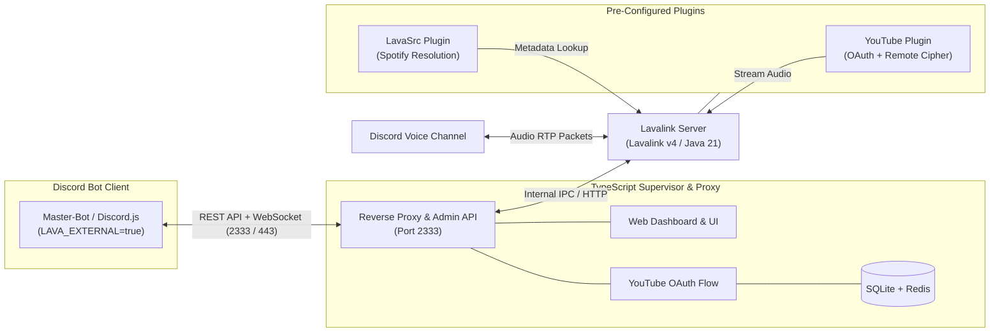

# 🔊 Lavalink v4 Server Documentation

Welcome to the official documentation for the **HELIX-Origin Lavalink v4 Server**.

This project provides a pre-tuned, containerized **Lavalink v4** audio node with an ESM TypeScript dashboard and process supervisor, optimized for deployment on **Heroku** (via the Heroku CLI) as well as dedicated Linux VPS environments and self-hosted Docker installations.

---

> [!WARNING]
> ### ⚠️ Cloud Hosting Ban Advisory (Render, Railway, Fly.io)
> **Do NOT deploy Lavalink to free shared cloud platforms like Render or Railway.**
> Platforms like Render and Railway aggressively flag and ban user accounts for running continuous audio streaming proxies and YouTube scraping containers.
> 
> **Supported Hosting Options:**
> - **Heroku:** Supported via manual CLI deployment (`heroku.yml` & `Dockerfile`) with dedicated dyno allocation.
> - **Dedicated VPS:** Recommended for production bots (Hetzner, DigitalOcean, Linode, OVH, Oracle Cloud VM).
> - **Self-Hosted:** Run on your local network or server with Docker Compose.

---

## ⚡ Overview & Purpose

Discord music bots require significant CPU and networking resources to stream and transcode high-bitrate audio packets over WebRTC voice connections. Running an internal audio node inside the same process as your bot quickly leads to **Out-Of-Memory (OOM)** errors, Gateway lag, and audio skipping.

This standalone repository solves that problem by packaging Lavalink v4 in an isolated, lightweight container with an integrated TypeScript supervisor:
- **Pinned Lavalink JAR:** The official Lavalink v4 release JAR (currently **4.2.2**) is committed in the repository and copied into the image for reproducible builds.
- **Interactive Web Dashboard:** Modern glassmorphic status dashboard with real-time player telemetry, node statistics, system logs, and YouTube OAuth controls.
- **Pre-Configured Plugins:** Out-of-the-box support for the official **YouTube Plugin** (with remote deciphering and OAuth) and **LavaSrc** (Spotify metadata resolution).
- **Environment Variable Mapping:** All `application.yml` properties dynamically read from environment variables, eliminating the need to rebuild images to change settings.
- **In-Memory & Persistent Caching:** In-memory caching with Redis and persistence in SQLite for authentication tokens and system configurations across restarts.

---

## 🧭 Architecture

---

## 📖 Wiki Table of Contents

- [**Deployment Guide**](Deployment.md): Complete instructions for manual Heroku CLI deployment, Dedicated VPS setups, Docker Compose, and Nginx SSL reverse proxying.
- [**Configuration Reference**](Configuration.md): Comprehensive breakdown of `application.yml`, JVM tuning, and environment variable keys.
- [**Plugins Guide**](Plugins.md): Setup instructions for YouTube Remote Cipher, YouTube OAuth2 authorization, and Spotify credentials.
- [**Client Integration**](Client-Integration.md): Code examples connecting Master-Bot, Lavalink-Client, Shoukaku, and Kazagumo.
- [**Troubleshooting & FAQ**](Troubleshooting.md): Solutions for 401 Unauthorized errors, YouTube stream 429 blocks, memory limits, and WebSocket disconnects.
